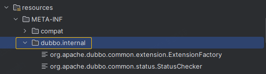
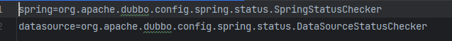
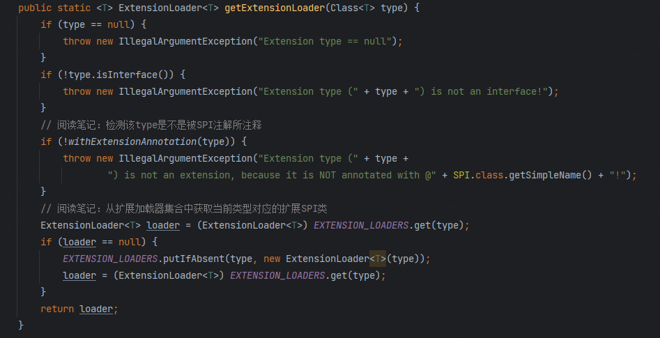
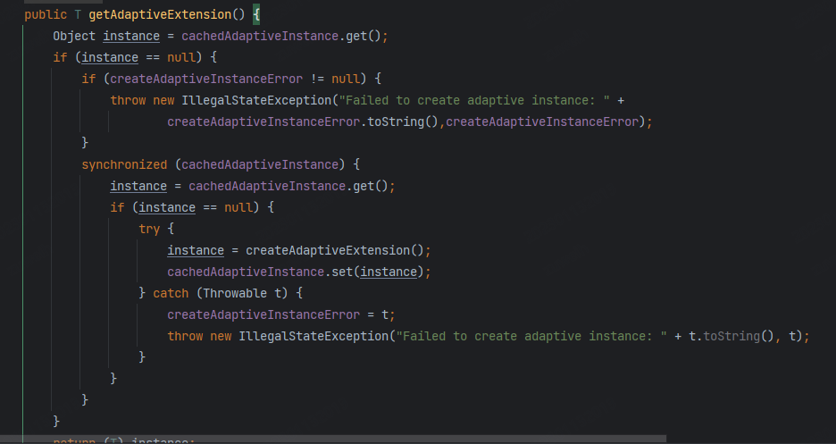
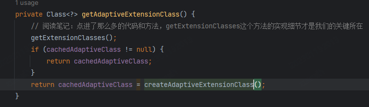
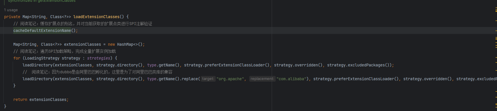
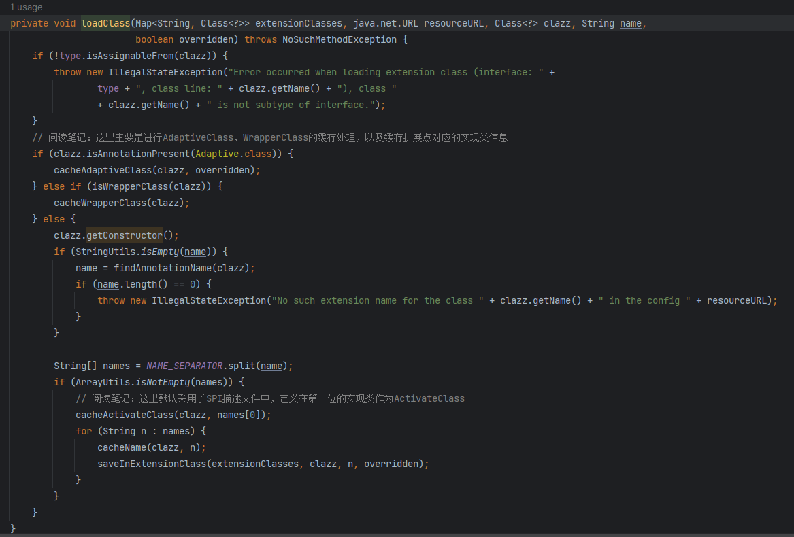
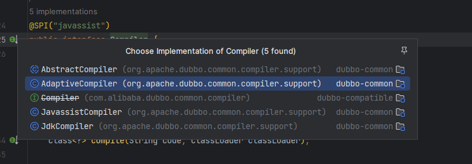
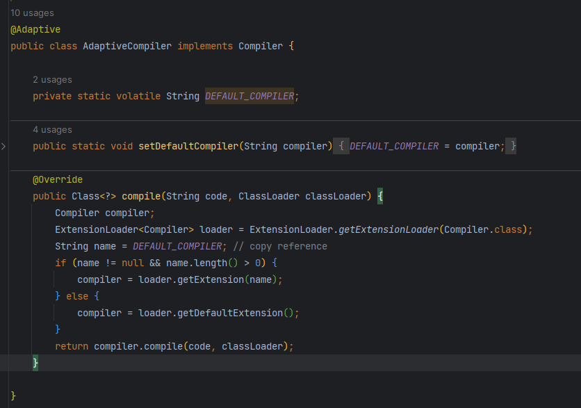

# Dubbo框架的核心

阅读过dubbo源码的你，肯定能发现，在dubbo的源码里会时不时就出现这样一段代码片段：`ExtensionLoader.getExtensionLoader(Example.class)`。
看起来很简洁的一段代码，背后却蕴含着巨大的能量！ 使我们可以对Dubbo中的很多组件进行无侵入，个性化的替换，这也是dubbo源码的核心所在。
这也就是dubbo的SPI机制，dubbo高频面试必问技术原理！

## SPI机制

SPI的全称是Service Provide Loader，顾名思义就是加载服务信息的，通过在项目的指定目录中来读取和加载服务的实现类来实现动态服务探测的目的！
这种机制在java中就有支持，只不过比较简单和功能比较单一，很多框架都对这种机制进行过改造和优化，例如Spring中的factory，
dubbo的SPI类型的接口都对该技术进行了使用。那么我们就来看看dubbo是如何使用并对SPI的机制进行改造和升级的。

### dubbo-SPI使用

在dubbo的源码中，关于SPI的实现都在`org.apache.dubbo.common.extension`里面，通过这里面的源码就可以看到dubbo的SPI是如何运行和处理的。
dubbo的SPI服务目录（默认）有下面三个：

- __META-INF/dubbo/internal/__，该目录对应得记载类是org.apache.dubbo.common.extension.DubboInternalLoadingStrategy
- __META-INF/dubbo/__，该目录对应得记载类是org.apache.dubbo.common.extension.DubboLoadingStrategy
- __META-INF/services/__，该目录对应得记载类是org.apache.dubbo.common.extension.ServicesLoadingStrategy

如果我们想扩展的某个支持SPI的组件，只需要实现对应的接口或者抽象基类，并在上述得三个目录中，添加对应得key-value键值对即可。



> 这里需要关注一个对应关系，就是一个SPI功能接口都会对应一个ExtensionLoader实例！

### dubbo-SPI源码阅读

在使用得过程中，我们了解到不通文件目录下对应了不同的服务加载类。现在来阅读一下SPI的源码，加深代码理解的同时，也来学习一下设计者的技巧和经验。

#### ExtensionLoader（SPI的核心类）

阅读过源码后者听说过的你，或多或少都会听到这个类，这个类的职责就是帮我们选一个给定的SPI接口实现类来提供给我们使用。调用的方法相当的简单易用，
像下面这样子操作，你就可以很容易获取到Protocol接口的实现类：

```java
class Exemple {
    public void getProtocolImpl() {
        Protocol p = ExtensionLoader.getExtensionLoader(Protocol.class).getAdaptiveExtension();
    }
}
```

当我们存在多个Protocol实现类时，它是如何确定应该返回那个的呢？那就带着这个问题来阅读源码吧！！！
当打开这个类的时候，看到它的属性定义是不是有那么一点眼熟却又有点不一样呢？没错，应该会想到了spring的BeanFactory（如果你阅读过它的源码的话），
相似的缓存机制！我们不难得到一个结论，SPI对应的实现类在程序运行过程中是唯一的，并且每一个实现类都是单例的！

##### getExtensionLoader方法


在源码中会看到大量调用这个方法的代码片段，也正是因为这样做，才造就了dubbo强大的spi机制！想要被SPI扩展，对应的接口类就必须携带SPI的注解，
这里的第一步就是对传入的class实例进行SPI注解的校验，必须是一个合法的SPI类型！对于一个合法的SPI类，优先从本地的缓存`EXTENSION_LOADERS`
获取这个类型对应的`ExtensionLoader`实例，当不存在时会创建一个新的`ExtensionLoader`并返回，细心的你会发现这里的not-exist-create，
并没出现`synchronized` 关键字，那么多线程访问的是不是会出现多次create的操作呢？答案当然时不存在的，因为这里的map采用了ConcurrentHashMap来处理，已经帮我们处理了并发问题！！！

#### getAdaptiveExtension方法


在获得到了ExtensionLoader之后，我们就可以按照自己的需求来获取你想要的实现类了，大多数情况下，我们会通过`getAdaptiveExtension`
来获取对应的实现，通过方法名，很直接的就提示了我们，这个方法会在帮我们适配并返回运行过程中最优的实现类给我们！
这个代码逻辑有没有很类似Spring的doGetBean方法，相比之下，这个段代码更简单，更直接，更简洁。都是通过从缓存中获取，不存在的时候则new出一个新的缓存返回。这段代码运用了常见的`DCL机制`
，来避免并发问题，熟悉并发你应该都知道这段代码在执行重排序（JVM优化时）的场景下，也不是线程安全的，使用`volatile`
修饰变量可以便可以做到。这里的Holder的value已经使用了`volatile`修饰，当前的修改对所有线程可见！所以也解决了指令优化重排序所造成的问题。

#### getAdaptiveExtensionClass方法


这是一个内部方法，帮助我们来加载SPI类所有的实现类，并将缓存过的实例返回给我们，若不存在已缓存过的实例，新建一个自适应的扩展类缓存并返回

#### getExtensionClasses方法

顾名思义，这个方法的职责很清晰，就是帮我们找到SPI接口所有的扩展实现类，同时完成类加载！这里为了防止多次重复加载采用了DCL机制

#### loadExtensionClasses方法


这里才是对SPI扩展点实现类进行加载的关键，按照加载策略进行分批加载，这里对alibaba的类库文件进行了兼容（因为dubbo由阿里孵化），`loadDirectory`
方法则是完成每个SPI目录下资源文件的读取，并对提供的SPI实现类进行加载和缓存！内部的`loadClass`
的主要职责是对adaptiveClass、wrapperClass、activateClass以及ExtensionLoader内部缓存的实例化工作！
优化和便捷我们对SPI的直接调用，无需关心如何选取SPI实现类来支持程序的运行！具体对扩展类的加载通过下图中的方法进行


## dubbo-SPI的编译器

为何存在编译器，编译器如何工作呢？带着问题，我们来看看它究竟干了什么!

通过上面类的继承图可以发现有三类编译编译器，这三类编译器的职责和编译方式也大不相同。值得注意的是，这里还有一个`AbstractCompiler`
，同时它也是JDK和Javassist的基类，这个抽象类实现了Compiler的complie接口，并提供了一个doCompile接口给子类来实现，当自身编译失败时，就会doCompile方法触发二次编译！

### JdkCompiler

//

### JavassistCompiler

//

### AdaptiveCompiler

采用指定的或默认的complier实现类完成源代码编译类加载，这个编译器用于对SPI扩展点动态生成的Adaptive实现类的编译工作。熟悉了SPI机制的你可以看到该类拥有Adaptive注解，所以ExtensionLoader.getAdaptiveExtension()
获取SPI实现类就是它


## DubboProtocol原理
