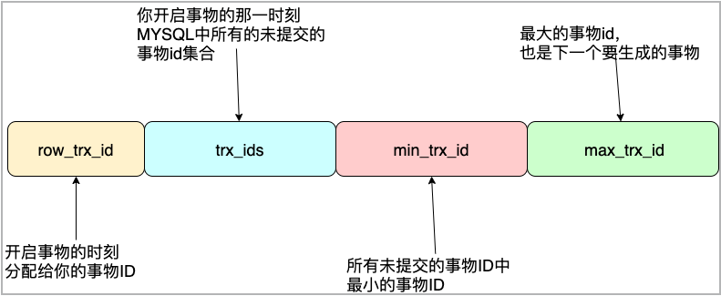

## Java面试可能遇见的那个它

### Java核心技术

+ 一个空对象多大内存？
  > 在hotspot虚拟的实现里一个对象对应内存布局采用OOP结构，主要有三个部分：对象头、实例数据、对齐填充。而对象头又包括三部分：对象头（MarkWord）、类（元数据）指针、数组长度！
  > + 对象头：用于存储对象运行时的数据，好比 HashCode、锁状态标志、GC分代年龄等，在64位操作系统中占用 __8个字节__，32位中占用 __4个字节__
  > + 指针：用来指向当前实例所归属的类实例指针，这里会涉及对指针的压缩处理，在开启指针压缩的状况下占 __4个字节__，未开启状况下占 __8个字节__
  > + 数组长度：这部分只有是数组对象才有，这部分占 __4个字节__
  >
  > 所谓的对齐填充，就是 Java 对象的大小默认都是按照 __8个字节__ 对齐，也就是说Java对象的大小必须是 __8个字节__ 的倍数。若是算到最后不够 __8个字节__ 的话，那么就会进行对齐填充！
  > 为啥非要进行 __8个字节__ 填充处理？看起来是对空间的一种浪费！这么做的原因是由于 CPU 进行内存访问时，一次寻址的指针大小是 __8个字节__，正好也是 L1 缓存行的大小。
  > 如果不进行内存对齐，则可能出现跨缓存行的情况，进而造成`缓存行污染`。 所以很容易就能算出来一个空对象所占用的内存大小正好就是 __16个字节__。

+ 为什么需要包装类型？int与Integer的区别？
  > + __原因：__
      因为Java本身就是一门面向对象的语言，对象是Java的基础操作单元。很多时候传递数据也需要对象类型，比如`ArrayList`、
      `HashMap`这些集合，只能存储对象类型，因此封装类型存在的意义就很大。封装类型还有很多好处，比如安全性较好，
      可以避免外部操作随意修改成员变量的值，保证了成员变量和数据传递的安全性！
  > + __区别：__
  >  + Integer的初始值是`null`，int的初始值是0;
  >  + Integer存储在堆内存中，int直接存储在栈空间；
  >  + Integer是对象类型，它封装了很多方法和属性。

+ “==” 和 “equals()” 有什么区别，为什么重写“equals()”时也要重写“hashcode()”方法？
  > 首先这两个比较操作存在着本质上的区别，“==” 判断的时引用地址（内存地址）的一致性，但是 “equals” 更偏向于判断对象的数据信息一致性，
  > 而且 “equals” 方法的第一行代码优先采用 “==” 作为判断！有些时候我们会重写 “equals” 方法来个性化判断对象是否相等，在这个重写的过程中，
  > 我们都知道也需要重写 “hashcode” 方法，可是为什么呢？原因是 `hashcode` 会被用来在集合类中查找定位元素，
  > 然而在jdk中默认通过随机数算法来生成 `hashcode`，势必会导致两个不同的对象可能会存在相同的 `hashcode`。
  > 假如仅重写了 “equals“ 而不重写 “hashcode“ 方法，就会造成集合类在存储和查找元素时，完全相同的对象因为 `hashcode` 被存储在了两个不同位置。
  > 这与事实是相违背的，所以提倡 “equals“ 与 ”hashcode“ 一起进行重写，这里也可以得到一个结论：两个完全相同的对象，它们的 `hashcode` 一定相同！

+ 关于HashMap如何解决hash冲突、如何进行内存扩容，底层数据结构的优缺点问题？
  > JDK1.7 采用了冲突链表解决 hash 冲突，JDK1.8 则采用链表加红黑树的方式解决 hash 冲突，
  > 链表长度大于 8 且元素个数达到 64 个时会转化为红黑树，当链表的个数小于 8 时变回链表
  > JDK1.7 扩容采用了头插法，并发环境下使用会导致`死循环`问题，对于一个`A->B-C` 的链会被反转为 `B->C->A`。 

+ ConcurrentHashMap实现原理？
  > + 1.8 中采用了数组 + 单向链表 + 红黑树实现数据存储；
  > + 并发安全的集合类，通过对 Node 加锁；
  > + 1.7 锁定的是一个 Segment，而 1.8 锁的是一个 Node，锁的范围更小，性能更好。
  > + 引入红黑树，降低了数据查询的时间复杂度，红黑树的时间复杂度为 O(logN)；
  > + 引入多线程并发扩容机制，对原始数组进行分片后，每个线程负责一个分片的数据迁移；
  > + 采用了 LongAddr 实现元素个数的原子累加。

+ ArrayList是如何实现自动扩容的？
+ CopyOnWriteArrayList是如何实现的，与ArrayList的区别？
  > 通过 ReentrantLock 控制并发，扩容时采用多线程分片复制的方式。CopyOnWriteArrayList 是一个安全的线程集合

+ AtomicInteger高并发下的性能问题？
  > 因为多线程同时进行数据修改，底层通过unsafe的CAS机制实现，会造成频繁的空循环问题，使用不当会造成cpu飙升！
  > 可以考虑通过`LongAddr`来避免，在`LongAddr`内部维护了一个数组，当出现并发操作进行多次修改后，
  > 会为每个线程分配一个单独的`AtomicLong`进行修改操作，避免了多个线程操作同一个值造成的性能问题（空循环）！

+ ThreadLocal的使用及原理，内存泄露的原因？
  > 利用了弱引用来作为 threadLocalMaps 的 key，当发生 GC 收集时会进行回收。

+ ThreadPoolExecutor的执行过程及原理？
+ 为什么不建议通过Executors创建线程池，如何定制线程池参数？
+ ForkJoinPool如何工作的，特点是啥？
+ ThreadPoolExecutor和ForkJoinPool的区别是啥，为什么要设计他们？
+ 同步队列有几种？各有什么特点，使用场景有那些？
+ 你是如何看待指令重排序问题的？
  > 操作系统通过对操作指令进行重新排序后不影响程序执行结果，从而提升程序执行的效率的一种手段。
  > 例如一个 Java 对象创建的过程中需要经历：1）内存分配、2）实例数据初始化、3）引用赋值三个步骤，
  > 当对 2，3 步骤进行顺序调换后，一般情况下并不会对程序的执行结果造成影响，然而在多线程的环境下是会存在问题的（例如：DCL下的单例实现），
  > 会导致线程在使用对象时，可能对象的属性还没有完成数据初始化造成不可预见的错误，可能存在的现象有：代码空指针异常问题、逻辑分支判断错误等！

+ Lock的使用问题？
+ 为什么会出现AQS，AQS的实现机制是怎样的，通过它可以干什么？
  > AQS是一种用于多线程队列同步器，JUC包中很多同步组件类都基于AQS进行实现。通过链表实现队列，目的是为了清理出现异常等待者。

+ 什么条件下会产生死锁，如何避免死锁？
  > 死锁的概念：当两个或两个以上的线程在执行过程中，去争夺同一个共享资源而导致相互等待的现象。
  > 产生死锁需要同时满足以下 4 个条件：
  > + 互斥条件：即一个共享资源只能被一个线程占用。
  > + 不可剥夺条件：当一个线程已经获得了共享资源 A，再去请求共享资源 B 的时候，不会释放目前已经占有的共享资源 A。
  > + 不可抢占条件：其他线程不能强行抢占一个线程已占有的共享资源。
  > + 循环等待条件：对于共享资源 A、B，线程 T1 已获得共享资源 A 等待共享资源 B，而线程 T2 已获得共享资源 B 等待共享资源 A，形成了循环等待。
  > 
  > 死锁的发生会影响程序的正确执行结果和服务的性能，那么如何避免死锁呢？对于产生死锁的 4 个条件，互斥条件是无法进行破坏的，因为它是互斥锁的基本约束。
  > 但是其他三个条件都可以通过任务干预来破坏，那么死锁问题自然也就解除了。破坏的手段通常有以下几种方式：
  > + 破坏请求和保持条件：我们可以在首次执行时一次性申请所有的资源，这样就不存在互相等待锁行为了！
  > + 破坏不可抢占条件：占有部分共享资源的线程在进一步申请其他共享资源的时候，如果申请失败那么可以主动释放已申请占用的共享资源。
  > + 破坏循环等待条件：通过给共享资源进行编号，线程按照编号顺序来申请共享资源的方式来避免死锁的产生。

+ Synchronize 如何实现的，它和Lock的区别是什么？

  > Synchronize 是通过 jvm 指令进行实现的，处于 Synchronize 中的代码块，在进行字节码转换的时会在代码块执行前后
  > 加入`monitorenter`，`monitorexit`指令。
  > Synchronize 天然支持可重入，ReentrantLock 支持可重入。
  > Synchronize 锁的释放是自动的，Lock 需要手动释放。

+ 使用过 JUC 包下的那些类，工作中用它都做了什么？
  > JUC 被称为 Java 并发工具包，里面提供了各种用于并发编程的工具和实现类，对于程序员来说是完全透明的，借助它们可以实现各种并发场景控制。
  > 常见的工具类有 LockSupport、AbstractQueuedSynchronizer、ReentrantLock、CountDownLatch等。

+ 你怎么看待 lambda 表达式，JDK内部如何是如何进行实现的？
  > lambda 本来存在于函数式编程中，Java 在 1.8 版本开始引入了这个思想和技术。
  > 有了它，Java 开始支持传递方法引用，简单来说就是将方法作为参数传递给另一个调用方法，在 Java 属于开启了新纪元一样。
  > Java 8 也借助它实现了 stream 流模型，stream 流的功能非常强大，提供了很多参数转换的手段，内部按照执行流的方式进行执行。
  > 它看起来像匿名内部类的实现方式，其实在 JDK 内部也是通过匿名内部类的方式来实现它，通过在编译阶段解析 lambda 表达式，生成对应的匿名内部类。

+ 实现动态代理的几种方式，如何看待动态代理？

  > 在java中实现动态代理有两种方式：1）JDK的动态代理，通过接口进行代理。2）javassist动态代理，通过继承的方式进行代理，
  > 无法实现`final`类的代理。动态代理的目的是实现类的增强机制，让我们可以在使用类之前对其增强发挥更加强大的作用。

+ Java中的IO类型有那些？NIO又是如何进行实现的？
  > Java 中存在很多 IO 类型包括：字节 IO、字符 IO、文件 IO、管道 IO、缓冲IO等。它的每一种 IO 都代表了一类数据交换的方式。

+ lombok是如何工作的？
  > lombok 在开发中可以帮我简化 setter、 getter 方法生成，日志类的注入、toString 方法的生成都可以通过它提供的注解完成，简化了代码结构！
  > 这些特性和能力都是通过实现 java 中的注解处理器 `javax.annotation.processing.AbstractProcessor`，对类字节码或源文件进行增强处理！

+ 零拷贝是什么？如何实现它？
  > 当用户程序与 OS 发生之间 IO 操作时，会涉及内存数据与磁盘数据的读写交换，一次完整的 IO 处理一般需要 4 次数据拷贝才能完成并涉及用户态和内核态的切换，
  > 这个样的 IO 操作的性能底下，对于数据读写频繁的系统来说很不友好。为了优化 IO 性能降低数据拷贝的次数，进而提出了 ”零拷贝“ 技术！

+ finalize 方法的理解？
  > 这个方法在 GC Roots 进行引用链标记的时候会检查，没有重写该方法则判断为死亡对象可回收，
  > 如果重写该方法但是从来没有调用过则会加入引用队列，后续会通过 JVM 的 Finalizer 线程进行去执行回收动作。
  > 这个方法也是对象逃逸 GC 回收唯一的一次机会，即将当前对象的引用赋值给活跃对象即可（当前对象也就加入了 GC Roots 引用链）。

### JVM相关

+ JVM 内存模型是怎样的？
  > 主要分为以下部分：方法区（JDK8 后采用元空间替代）、堆内存、虚拟机栈、本地方法栈、程序计数器。
  > 其中虚拟机栈、本地方法栈和程序计数器，这三个区域是线程私有的，方法区和堆内存属于线程的共享内存区域。
  > 垃圾收集器重点负责方法区和堆内存中垃圾对象的回收工作。

+ 垃圾回收算法有哪几种？
  > + 标记清除算法：
  > + 复制算法：
  > + 标记整理算法：

+ 判断对象可以回收的依据是什么？有哪些手段？
  > 判断一个对象能够被回收取决于这个对象是否还被其他对象所引用，简单来说就是当前对象还有没有依赖关系。 目前主要通过 __`引用计数法`__、__`可达性分析__` 这两种算法实现。
  > 引用计数法在两个对象仅存在互相引用或自我引用，而不存在外部引用的关系的场景中会引发计数器无法归零的问题，使得当前的对象始终无法回收导致内存泄露问题。
  > 早期的 JVM 曾采用过引用计数法，但现在的垃圾收集器都是基于可达性分析算法来判断对象能否被回收。通过选取多个 `GC Roots` 作为可达性分析的根节点，遍历整个引用链来区别活跃对象和可收回对象。

+ GC Roots 是什么？
  > GC Roots 是一个可以用于判断对象引用链是否有效的根节点（起始对象），从该节点开始可以被访问到的对象就是活跃对象，不被包括在内的引用链（不属于 GC Roots 的子集）或对象被称为“垃圾”对象。
  > 在Java语言中，可作为 GC Roots 的对象包括下面几种：
  > + 虚拟机栈中引用的对象（栈帧中的本地变量表）；
  > + 方法区中静态属性、常量引用的对象；
  > + 本地方法栈中引用的对象（JNI Native 方法）。

+ 常见的 GC 收集器有哪些？
  > 垃圾收集器按照其作用范围分为三类：
  > + 年轻代：Serial（单线程复制算法，存在STW）、ParNew（多线程复制算法，存在STW）、Parallel Scavenge（关注吞吐量、复制算法）
  > + 老年代：CMS（以获取最短回收停顿时间为目标的收集器、标记清除算法）、Serial Old（单线程标记整理算法，CMS后备收集器）、Parallel Old（关注吞吐量、多线程、标记整理（压缩）算法）
  > + 不分代：G1（面向服务端应用的垃圾收集器）、GZC

+ CMS 垃圾收集器的收集过程？
  > CMS 的垃圾回收过程分为四个步骤：初始标记、并发标记、重新标记、并发清除，这四个步骤的具体实现如下：
  > + 初始标记：暂停所有的其他线程，并记录下直接与 GC Roots 相连的对象，速度很快；
  > + 并发标记：同时开启 GC 和用户线程，用一个闭包结构去记录可达对象。但在这个阶段结束，这个闭包结构并不能保证包含当前所有的可达对象。
  > 因为用户线程可能会不断地更新引用域，所以 GC 线程无法保证可达性分析的实时性。所以这个算法里会跟踪记录这些发生引用更新的地方。
  > + 重新标记：重新标记阶段就是为了修正并发标记期间因为用户程序继续运行而导致标记产生变动的那一部分对象的标记记录，
  > 这个阶段的停顿时间一般会比初始标记阶段的时间稍长，远远比并发标记阶段时间短。
  > + 并发清除：开启用户线程，同时 GC 线程开始对未标记的区域做清除。
  > 
  > 只有在初始标记和重新标记阶段需要暂停用户线程，但是暂停的时间依然比较短，而垃圾对象的清理过程是同用户线程并发执行的。
  > 所以 CMS 有 `并发收集、低停顿的优点`，而采用“标记-清除算法”也就决定了它会产生内存碎片，当内存不足以分配当前对象时就会提前触发 FullGC 执行。对于并发标记阶段 GC 与用户线程并发执行，
  > 而这个时候用户线程产生的垃圾对象并不能被及时标记而导致“浮动垃圾”。

+ G1 如何工作？
  > 传统收集器将内存分代处理，并且各代的内存空间是连续的。而在 G1 中各代的内存空间不再是连续的，
  > 每一代都使用了 n 个不连续的大小相同的 Region ，每个 Region 占有一块连续的虚拟内存地址。
  > G1 在进行内存分配的时候会将对象大小大于等于 Region 一半的对象直接分配到老年代中，并标记为 `H-Obj`，防止反复拷贝移动。
  > G1 通过三色标记技术来对垃圾对象进行标记，这三种颜色分别是：白色、灰色、黑色，被这些颜色标记的对象含义如下：
  > + 白色：对象没有被标记到，标记阶段结束后，会被当做垃圾回收掉；
  > + 灰色：对象被标记了，但是它的 Field 还没有被标记或标记完；
  > + 黑色：对象被标记了，且它的所有 Field 也被标记完了。
  > 
  > 回收过程采用了 “标记-整理” 和 “清除” 算法相结合的模式，各个 Region 之间采用 “复制” 算法。进行垃圾收集的运行工作的步骤分为：初始标记、并发标记、最终标记、筛选回收。
  > 所以 G1 具有并行并发、分代收集、空间整合、可预测性的停顿等特点。
  > 不再以传统的方式进行内存分配，而是内存划分为指定大小区间的块（Region），通过块来完成内存的分配，采用标记清除 + 复制算法对垃圾对象进行回收。

+ ZGC 是如何实现的？
  > ZGC通过着色指针和读屏障技术，解决了转移过程中准确访问对象的问题，实现了并发转移。
  > ZGC 只有三个STW阶段：初始标记，再标记，初始转移。
  > 而 G1 存在四次 STW 阶段，分别是初始标记、再标记、清除、复制。

### 数据库技术

+ sql的执行过程及步骤？
+ mysql中的BufferPool机制？
+ mysql 中 InnoDB 与 MyISAM 引擎的区别？
  > + __存储结构__：MyISAM 在磁盘上存储为三个文件，分别是：.frm（存储表定义）、.myd（存储数据文件）、.myi（存储索引文件）。
  > InnoDB 仅存储为两个文件分别是：.frm（存储表定义）、.ibd（存储数据和索引文件）。
  > 通过文件分类可以看出，MyISAM 的数据和索引是分开存储的，叶子节点仅存储数据所在的地址而不是数据。
  > 而 InnoDB 则不同，叶子节点存储的是整个数据行所有的数据
  > + __存储空间__：MyISAM 可被压缩，存储空间较小，并支持三种不同的存储格式：静态表（默认，数据末尾不能存在空格，空格会被去掉）、动态表、压缩表。
  > InnoDB 则需要更多的内存和空间，它会在内存中建立自己专用的缓冲池（`buff_pool`）来高速缓冲数据和索引。
  > 同时 InnoDB 所有表都保存在同一个数据文件中（可能也是多个文件，或独立的表空间），数据表的大小取决于操作系统中文件的大小，一般为 2GB。
  > + __事务支持__：MyISAM 强调的是性能，每次查询都具有原子性，它的执行速度比 InnoDB 更快，但是提供事务支持。
  > InnoDB 除了提供事务支持和外部键等高级数据库功能，还具有事务提交、回滚和崩溃修复能力等这些事务安全功能。
  > + __锁支持__：MyISAM 在只是大量数据查询的场景中性能更好，增删数据的时候锁定的是整个数据表，效率会低很多。
  > InnoDB 支持行级锁、删除、插入的场景中只需要锁定需要操作的数据行即可，在有大量数据插入、修改、删除数据的场景中，性能更优越。
  > + __外键支持__：MyISAM 不支持外键，而 InnoDB 支持。

+ B树和B+树？
  > + B 树的所有数据存储在每个节点上，而 B+ 树的数据只储存在叶子节点上，并且采用双向链表将所有叶子节点串联起来；
  > + B+ 树得子树等于它的关键字数量，而 B 树等于它的关键字数量加一；
  > + B+ 树能更好地支持范围查询，只需要遍历叶子节点即可，而 B 树则需要遍历整个树，时间复杂度为 O(logN)

+ 为什么要用 B 树或 B+ 树作为索引结构？
  > 因为 AVL 树的高度要比 B 或 B+ 树高度更高，而树的高度意味着磁盘 IO 的数量，所以为了减少磁盘 IO 的数量，文件系统或数据库才会使用 B 或 B+ 树作为索引。

+ mysql 的索引结构为什么采用 B+ 树？
  > + __磁盘IO__：因为 B+ 树的非叶子节点不存储数据，所以每一层能够存储的索引数量更多，那么磁盘 IO 的次数也就间接的减少了。
  > + __范围查询__：B+ 树仅在叶子节点上存储数据，叶子节点之间通过双向链表相连。范围查询时只需要查询起止两个节点进行遍历即可，
  > 而 B 树需要获取所有节点，所以 B+ 树在范围查询上效率更高。
  > + __全表扫描__：B+ 树只需要扫描叶子节就行了，而 B 树需要遍历整个树。
  > + __自增ID__：B+ 树采用自增整型数据作为主键，能更好的地避免增加数据是，叶子节点分裂导致的大量运算问题。

+ mysql 索引类型有哪些？
  > MySQL 有很多种类型的索引，例如：主键索引、唯一索引、联合索引、外键索引、普通索引、前缀索引等等。
  
+ 导致索引失效的场景有那些？
  > + 在索引列上做运算。当在数据列上使用函数时，会导致 mysql 无法识别索引列而不使用索引的情况。不过 mysql 8.0 版本开始，增加了函数索引，可以解决这个问题。
  > + 不符合最左匹配原则。当对联合索引的多个列进行数据查询时，应该按照这些列对应的联合索引顺序进行查询，按照最左匹配的原则进行查询，否则不会使用索引。
  > + 索引列的隐式转换。当索引列是字符串类型，而在执行查询的 sql 中没有使用引号，那么 mysql 会自动进行类型转化，从而导致索引失效。
  > + 索引列使用不等号、not 查询的时候。由于索引数据的检索效率非常低，因此 mysql 引擎会判断是否使用索引。
  > + 使用 like 通配符后缀匹配。如果我们在索引列上使用了 like 这种通配符进行查询，必须有要符合最左匹配的原则，否则不会使用到索引。
  > 例如 `"%xxx"` 不会使用索引，但是 `"xxx%"` 会使用索引进行查询。
  > + 使用 or 连接查询。or 语句前后没有同时使用索引，那么索引会失效。只有 or 语句的左右查询字段都是索引列的时候，才会生效。

+ mysql 的事务如何实现的？
  > 通过 undo_log 和 redo_log 进行实现。undo_log 里面记录了数据修改前的数据快照，redo_log 里面记录了数据修改后的数据快照。

+ mysql 对 MVCC 实现的原理？
  > MVCC (Multi-Version Concurrency Control)，即多版本并发控制技术。
  > 通过这个技术，可以让大部分支持行锁的事务引擎，不在单纯地依赖行锁进行数据库并发控制，而是将行锁和数据行的多个版本结合起来只需要很小的开销，
  > 就可以实现非锁定读，从而大大提升数据库系统的并发性能。MVCC 是通过保存数据在某个时间点的快照来实现的，不同存储引擎的实现方式是不相同的，典型的有乐观锁并发和悲观锁并发控制。
  > InnoDB 的 MVCC 是通过在在每个数据行记录后面保存两个隐藏列（假设为 `create_version` 和 `delete_version` ）进行实现的。
  > create_version 保存数据行的创建版本号（可看作事务ID），delete_version 保存数据行的删除版本号（可看作事务ID），
  > 保存的值对应操作当前记录时的版本号（事务ID）信息，每次开启一个新事务这个 ID 就会自增。数据进行增删改查所对应的版本控制情况如下：
  > + 查询数据时：`create_version` 小于等于当前事务 ID，保证当前事务读取的数据之前就存在或当前事务增加修改的；`delete_version` 不存在或大于当前事务 ID，确保当前事务读取的数据在事务开始之前还没有被删除。
  > + 插入数据时：`create_version` 记录插入数据的事务 ID，`delete_version` 为空。
  > + 删除数据时：`delete_version` 记录删除数据的事务 ID，`create_version` 为空。
  > + 修改数据时：将修改数据视为 `“删除旧数据，插入新数据”` 的组合，即先将原有数据复制一份，原有数据的 `delete_version` 记录修改数据的事务 ID，`create_version` 为空。复制出来的新数据的 `create_version` 记录修改数据的事务 ID，`delete_version` 为空。
  > 
  > 此时，如有另外一个事务要读取这些发生了变化的数据，将根据隔离级别来决定到底应该读取哪个版本的数据。

+ mysql 可重复读（RR）实现原理？\
  \
  > 每个事务所对应操作记录都会被写入 `undo_log` 中，并且通过链表的方式将这些 `undo_log` 的记录进行关联（利用向前的指针进行串联），
  > 当一个事务再次读取同一条数据发现对应事务 ID 发生变化（大于当前事务 ID ），则说明其他事务对该数据记录进行了变更修改，
  > 当前事务就会通过 `undo_log` 链向前寻找到小于当前事务 ID 的数据，这就是mysql 可重复的快照机制，并且这个快照在当前事务未提交前都是有效的。

+ 执行计划（explain）的内容都有什么？
+ 为什么需要进行分库分表？工作中如何实现分库分表？
  > 当业务数据持续增加，达到千万及亿级别的情况下，为了保证数据库的 IO 性能以及数据表的检索效率，因此需要进行分库分表的优化，拆分的方式分为：垂直和水平两种。
  > 垂直拆分的方式是通过将业务表中的业务数据进行更细粒度的业务拆分，使数据其他附属业务数据之间通过主表进行关联映射，使得业务数据更加聚合，避免业务表过于臃肿而带来的查询性能问题。
  > 例如订单表中的一些取消政策，产品信息等可以单独拆分出业务表进行存储，业务表之间通过订单号进行关联。
  > 水平拆分是将大量数据通过分片键进行 hash 分片存储，hash 结果一致的数据存放在同一张表中，从而降低单数据表的存储压力。
  > 比如将用户表表拆分成 `user_0`、`user_1`、`user_2`...`user_n` 这种存储方式，

+ 优化数据查询的方式有那些？
  > 对SQL的优化的方式有很多中，优化需要结合索引结构、数据结构、业务能力等多个方面而进行，否则我们的优化毫无意义！优化的方式有：
  > + 加索引：mysql表的索引不是越多越好，能够满足自身业务需求就好，不要盲目的去加索引
  > + 联合索引：当我们的业务场景中会使用到多个查询条件的时候，我们可以考虑对查询的多个条件建立联合索引
  > + 减少不必要字段的输出：编写 sql 查询语句时，一定要保持一个用什么查什么的习惯，切记一股脑的将所有字段列查询出来。这么做会占用数据库实例的带宽，数据IO的时长也增加
  > + 避免子查询：如果执行的 sql 存在子查询，那么执行时会建立一张临时表用于存储子查询的结果集，对于临时表的创建都会是一种性能上的消耗，查询的效率大大降低。
  > 优化方式有：1）拆分成两次独立查询，并结合 in 关键字进行优化；2）将子查询降级为 join 联合查询，但是并不建议这么做！
  > 
  > + 分库分表：当我们的数据量是千万级、亿级的话，单表查询就无法快速索引数据（毫秒级别），因为mysql采用了B+树的索引方式，当树的级别超过 3 层就会存在性能。
  > 一般建议单数据表记录数应该不超过 400w 左右，否则就应该采用分库分表的方式来优化数据存储。

+ 事务的隔离级别有哪些？
  > 事务隔离是了解决多个并行事务竞争导致的数据安全问题的一种规范，最终目的是保证事务执行结果的数据一致性！
  > 一共存在读未提交、读已提交、可重复读、串行化这四种事务隔离级别。下面针对各个级别的特点和所产生的问题进行详细介绍：
  > + __读未提交__：一个事务在执行过程中读取了另一个事务未提交的内容。这种隔离级别下，可能会出现脏读、不可重复读、幻读问题。
  > + __读已提交__：一个事务在执行的过程中，读取到了另一个事务已经提交的内容。这种隔离级别下会产生不可重复读、幻读问题。
  > + __可重复读__：一个事务执行过程中先后两次读取到另一个事务所操作的数据，两次读取的结果一致。这种隔离级别会出现幻读问题。
  > + __串行化__：并行事务的操作具有先后顺序，有序进行，这种隔离级别可以解决所有问题，但是性能也是最低的。
  > 
  > MySQL 的 InnoDB 引擎默认采用可重复读的隔离界别，并通过 MVCC、临键锁、undo_log、redo_log 保证事务的数据一致性问题。 

+ mysql中的锁有那些？
  > + __表锁__：锁定当前锁所操作的数据表。
  > + __行锁__：会锁定当前所操作的记录。
  > + __间隙锁__：锁定一个左开右开的区间，不包含当前记录行。
  > + __临建锁__：是行锁与表锁的组合，锁定一个左开右闭的区间，包含了当前锁操作的记录行。

+ 如何理解 mysql 主从同步机制？
  > 数据同步过程中一般会出现两个常见的问题：1）数据丢失；2）同步延迟，mysql 的主从库数据通过 bin-log 和 relay-log 复制读写完成，
  > 而且 mysql 通过两个手段解决了 上述的两个问题，具体手段如下：
  > + 半同步复制：要求主库写完 bin-log 后，强制将数据同步给从库，收到从库返回的 ack 消息后才认为数据写入成功；
  > + 并行复制：从库开启多个线程并行读取 relay-log 中不同库的日志，避免了单线程执行而造成的数据延迟。

### 缓存技术

+ 为什么需要缓存？ 
  > 为了实现高性能、高并发、打造时延性更低的应用程序，通过引入缓存可以很好地解决这个问题。
  > 当程序中某些数据做查询时花费的时间很长（200ms+），但数据又不怎么变化的情况下，引入缓存是充分非必要的手段。
  > 而且缓存对于那些读远远高于写的业务场景来说简直就是一剂良。其实我们所接触的很多技术都有涉及对缓存的运用，
  > 例如：CPU的三级缓存、MySQL的buffer_pool机制，spring中使用到的三级缓存技术等等，都是为了更快地响应和处理数据而选择的技术方案。

+ 使用缓存会带来什么问题？
  > 虽然缓存能够提供更好的性能，我们任何事物都具有双面性，对于缓存而言也不列外。它的好也决定了在运用它的时候也会出现各种问题，常见的问题主要有：
  > + 缓存和数据库双写不一致
  > + 缓存雪崩、缓存穿透、缓存击穿
  > + 缓存并发竞争

+ 缓存雪崩、缓存穿透、缓存击穿分别指什么？如何进行避免呢？
  > 这三个问题在缓存使用场景中会常常被提到，接下来就针对这三个问题的场景及解决方案进行分讨论，首先看看产生这些问题的场景怎样的：
  > + __缓存雪崩__：整个缓存系统处于挂掉完全不可用状态，导致所有数据查询都不走缓存，而直接访问数据库的一种现象。
  > + __缓存穿透__：业务在进行数据查询时，查询了一个压根就不存在的数据无法命中缓存，每次都需要访问数据库的场景。
  > + __缓存击穿__：缓存中的某个热点key在某一时刻过期，后续对于这个key的高并发访问直接请求数据库，就像是在缓存的屏障开凿了一个洞一样。
  > 
  > 针对产生这些问题的现象和场景，我们应该从中找到突破口进行修复或者避免该问题的发生，从而提高缓存的安全性和可靠性。避免的手段与解决方案如下：
  > + __缓存雪崩__：1）通过主从、哨兵等方式搭建高可用的 redis 集群；2）增加本地缓存；3）对 DB 请求进行限流降级。
  > + __缓存穿透__：1）为查询不到的数据进行短暂的缓存，并设置过期时间进行缓冲。2）通过使用 redis 中的布隆过滤器进行判断。
  > + __缓存击穿__：1）在进行数据缓存时，设置不同的过期值，同业务下的 key 通过对不同的数据 key 的过期时间加随机避免同时过期！
  > 2）不会发生更新数据设置缓存永久不过期；3）数据更新不频繁，使用分布式锁降低对 DB 资源的请求量。 

+ redis有哪些基本数据类型？
  > 主要有5大基本数据类型：字符串（String）、列表（list）、哈希表（hash）、无需集合（set）、有序集合（zset）。
  > 其次还有一些展类型例如：Bitmaps（位图）、HyperLogLog（一种概率数据结构，用于估计集合的基数）、Geospatial（地理位置信息）。
  > Bitmaps 与 HyperLogLog 都是基于 redis 中的 string 进行实现的。
  > + __字符串__：redis 没有采用 C 语言原生的 string 作为实现，而是定了一个 SDS 结构体作为底层实现，主要有三部分组成：len（长度）、free（空闲空间）、buf数组（真实数据）。
  > 在 C 语言中，字符串通过 `\0` 作为结束标记无法保存特殊字符，而 redis 可以做到，所以 redis 的 string 是一个 `二进制安全` 的数据结构，
  > 对于长度获取的时间复杂度为 O(1)，扩容无需频繁分配内存通过 free 属性做了 `空间预分配` 和 `惰性空间释放` 两个优化，修改时通过判断长度和空闲空间的大小来避免缓冲区溢出问题。
  > + __列表__：底层基于链表、压缩列表、快速列表来实现（各个不同的版本可能存在差异）。实际开发过程中，列表会被用做栈（stack）和队列（queue）的实现（使用频次高）。
  > 使用场景有：粉丝列表、评论列表、消息队列、高性能分页查询等。
  > + __哈希表__：通过压缩链表或者哈希表（字典）来进行实现。当数据量比较大时，不建议采用 `getAll` 来全部数据应该使用 `scan` 模式进行替换。
  > 使用场景有：用户核心信息、某些对象的高频数据等，只要用于存储一些结构化数据（仅用于简单属性的对象）。
  > + __无序集合__：通过 intset（整数数集）、 哈希表（字典）实现其功能，核心能力就是对加入集合中的元素进行去重，相同元素的多次添加不会影响集合中的数据状态，同时支持集合的并、交、差等操作。
  > 使用场景有：共同好友，可能认识的人，数据去重等业务中。
  > + __有序集合__：利用压缩列表、跳跃表进行实现，与无序集合最大的区别是集合中的元素有序，通过为每个元素增加 `score` 属性保证有序性，同时允许不同元素可以存在相同的 `score`。
  > 使用场景主要有：滑动窗口、优先/延迟队列等。

+ redis的线程模型是怎样的？如何支持高并发，速度又为何快？
  > + 模型：redis 内部使用文件事件处理器并采用了单线程的方式进行实现，因此也叫做单线程模型。需要注意的是在 6.0 版本以后开始采用多线程模型，
  > 这里的多线程模型仅用来处理网络数据的读写和协议的解析（为了利用 IO 期间的 CPU 资源），redis 命令的执行方式依然采用单线程
  > （因为多线程反而会更加复杂，需要去控制key、 Lua、事务、LPUSH/LPOP所产生的并发问题）。
  > + 高并发和快的原因：redis 选择基于 epoll 的 IO 多路复用的方式实现非阻塞 IO 。数据的操作均在内存中完成（内存的处理速度众所周知的快！）， 
  > 选择简单的单线程方式进行数据操作，避免了多线程环境下的上下文切换和锁竞争。采用了 C 语言进行开发实现，而 C 语言程序对于系统而言执行起来更加高效！

+ Redis和Memcached有啥区别？
  > + __数据结构__：redis 拥有更多的数据接口，同时也提供更加丰富的数据操作，当我们需要进行复杂数据结构操作的时候 redis 是不错的选择！
  > + __集群能力__：redis 在 3.x 版本之后，就能够支持 cluster 模式，然而 memcached 没有原生的集群模式，依赖客户端实现对集群中分片数据的写入操作。
  > + __性能优势__：在进行数据存储时，redis 采用单核，而 memcached 采用多核。平均到每一个核上 redis 在存储小数据处时对 memcached 性能更高，
  > 而在 100k 以上的数据中，Memcached 性能要高于 Redis！

+ 跳跃表是一种怎样的数据结构？
  > 是一种随机化数据结构，查找、添加、删除操作都可以在对数期望时间下完成。
  > 跳跃表目前在 Redis 的唯一作用，就是作为有序集类型的底层数据结构（之一，另一个构成有序集的结构是字典）。
  > 为了满足自身的需求，Redis 基于 William Pugh 论文中描述的跳跃表进行了修改，包括：
  > + score 值可重复。
  > + 对比一个元素需要同时检查它的 score 和 member 。
  > + 每个节点带有高度为 1 层的后退指针，用于从表尾方向向表头方向迭代。

+ redis的过期策略和内存淘汰机制是怎样的？
  > 过期策略是定期删除、惰性删除；内存淘汰机制：1）不驱逐，写入报错、2）allkeys-lru（所有key找到最少使用）、3）allkeys-random（所有key随机删除）
  > 4）volatile-lru（设置过期的key中，找到最少使用）、5）volatile-random（设置过期key中，随机删除）、6）volatile-ttl（设置过期key中，更接近过期时间的删除）

+ redis数据持久化模式是怎样的？
  > + __RBD持久化__：对 redis 中的数据进行周期性的数据持久化，按照不同的时间段生成 RDB 文件。
  >   + `优点`：可以对生成的多个 RDB 文件进行云备份存储（上传文件至云服务器），RDB 数据文件很适合做数据冷备份。
  >          数据备份通过 fork 一个子进程进行数据备份，不会对 redis 对外的读写服务造成性能上的影响，依然可以保持高性能的服务。
  >          相对于 AOF 模式，当前模式的进行数据恢复的过程更快。
  >   + `缺点`：因为采用周期性的方式来备份数据，一般进行数据备份的时间间隔在 5min 左右（甚至更长），可能无法满足尽可能少地丢失数据的场景。
  >          当一个 fork 的子进程对数据进行快照文生成时，如果数据文件太大，可能会导致对客户端提供的服务造数毫秒，甚至数秒的停顿。
  >   
  > + __AOF持久化__：以 redis 中的每条写指令作为日志，采用追加写入的模式（append-only）写入日志文件中。在重启的过程中，通过重放这些命令来恢复数据。
  >   + `优点`：一般都是一秒执行一次 `fsync` 操作，相对于 RDB 能够更好地保证数据不丢失。
  >            通过 `append-only` 的方式写文件，没有任何磁盘寻址的开销，所以写入性能非常高。并且文件不易被破坏，即使文件尾部受损也很容易进行修复。
  >            即使日志文件较大出现后台重写操作时，也不会对客户端的读写性能造成影响，因为 `rewrite` log 会进行指令压缩，在压缩生成新文件的过程中，
  >            老的文件依然正常写入，当 `merge` 后的新文件 `ready` 后再进行新老文件交换即可。 
  >            通过可读较强的方式进行记录，这个特性非常适合做灾难性的误删除的紧急恢复，比如不小心执行了 `fushall` 命令，可以通过修改 AOF 文件，
  >            对命令进行删除，然后覆盖原来的文件即可修复这个错误操作。
  >   + `缺点`：对于一份相同的数据来说，AOF 的日志文件通常要比 RDB 的数据快照文件更大。AOF 模式下，redis 写操作的 QPS 会比 RDB 模式下的写 QPS 更低。
  >            会出现执行数据恢复的操作，却没能将数据一摸一样恢复回来的 bug 现象，不过这个问题可以在 `merge` 时通过当时内存中的数据进行指令的重新构建，
  >            而不是采用旧的指令日志。
  > redis 支持同时开启以上两种数据持久化备份方案，所以我们可以用 AOF 来保证数据不丢失，用作数据恢复的第一选择；用 RDB 来做不同程度的数据冷备份，
  > 当 AOF 文件都丢失或者损坏不可用的情况下，使用 RDB 来进行数据的快速恢复。

### tomcat技术

+ 如何实现Servlet？
  > 实现Servlet接口，实现其 `service` 方法编写自己的业务逻辑。
  
+ 如何看待jsp技术？
  > JSP 全称是Java服务页面，一种服务于 Servlet 容器的页面模板引擎。最终通过解析 JSP 的代码，将其渲染为 Servlet 接口的实现类，从而实现页面服务的能力。

+ 核心组件有哪些，都有什么作用？
  > 核心组件有以下几类：
  > + Server： 指的就是整个 Tomcat 服务器，包含多组服务（Service），负责管理和启动各个 Service，同时监听 8005 端口发过来的 shutdown 命令，用于关闭整个容器 。
  > + Service：每个 Service 组件都包含了若干用于接收客户端消息的 Connector 组件和处理请求的 Engine 组件。 
  > Service 组件还包含了若干 Executor 组件，每个 Executor 都是一个线程池，它可以为 Service 内所有组件提供线程池执行任务。
  > + Connector：连接器对 Servlet 容器屏蔽了不同的应用层协议及 I/O 模型，无论是 HTTP 还是 AJP，在容器中获取到的都是一个标准的 ServletRequest 对象。
  > + Engine：引擎，Servlet 的顶层容器，用来管理多个虚拟站点，一个 Service 最多只能有一个 Engine；
  > + Host：虚拟主机，负责 web 应用的部署和 Context 的创建。可以给 Tomcat 配置多个虚拟主机地址，而一个虚拟主机下可以部署多个 Web 应用程序；
  > + Context：Web 应用上下文，包含多个 Wrapper，负责 web 配置的解析、管理所有的 Web 资源。一个Context对应一个 Web 应用程序；
  > + Wrapper：表示一个 Servlet，最底层的容器，是对 Servlet 的封装，负责Servlet 实例的创建、执行和销毁。
  >
  > 简单来说，这些组件之间大概的关系是：一个 Server 就是一个 Tomcat 服务，它包含了多个 Service，而 Service 内部包含了多个 Connector，
  > 但是仅有一个 Engine 实例。Engine 也是 Tomcat 中的顶级容器，同时也是 Host，Context，Wrapper 的父级容器。除了 Engine 是单一实例外，
  > 它的子类容器同时可以存在多个，这几个容器的按照由父至子的关系是：Engine -> Host -> Context -> Wrapper。

### dubbo技术栈

+ 什么是rpc？
 > RPC 全称是 Remote Procedure Call 翻译过来就是远程过程调用。是一种通过网络从远程计算机程序上获取服务，而不需要了解代码的网络技术实现的一种协议。
 > 专业术语的解释读起来比较生硬，其实可以简单的理解为进行远程服务调用过程一种的协议，符合这个远程服务能力调用的技术实现都可以被称之为 RPC 技术。
 > RPC 强调的是过程调用，调用的过程对于用户（一般来说就是开发人员）来说是完全透明的，不需要关心其实现细节，可以像调用本次服务一样调用远程服务。
 > RPC 协议需要包含四个组件分别是：Client、ClientStub、Server、ServerStub。RPC 在分布式系统中有着非常广泛的应用，比如：
 > + 分布式系统网路通信
 > + 分布式子系统之间的服务治理
 > + 分布式负载均衡和流控
 > + 服务发现和注册
 > + 构建分布式调试环境

+ 什么是dubbo及特点？
  > dubbo 是一个 RPC 框架起源于 Alibaba 内部，目前已贡献给 apache 基金会进行孵化、迭代和维护。
  > 特点：分布式（多服务提供者和消费者）、高性能（基于 Netty 实现 NIO 通信）、透明化（可以像调用本地方法一样进行调用），
  > 同时提供了服务注册、服务发现、服务监控、服务降级等服务治理手段。

+ dubbo的启动过程是怎样的？
  > dubbo 服务启动是在 spring 容器启动完成后开始执行的，通过 spring 提供的 `BeanPostProcessor`、`BeanDefinitionRegistryPostProcessor`、`NamespaceHandlerSupport`、`ImportBeanDefinitionRegistrar` 等多个扩展点， 
  > 并结合 dubbo 提供多种配置方式将 dubbo 服务相关的 bean 注入 spring 和 dubbo 容器上下文当中，在这个环节中 `DubboSpringInitializer` 的作用很重要！
  > dubbo 通过监听 spring 容器加载完成的事件，通过 `DubboBootstrap` 启动类完成 dubbo 服务启动、注册、绑定等各个阶段的工作，保证 provider 和 consumer 能够正常服务！  

+ 如何看待 Exchanger、Transporter、Exporter、Protocol 等各个核心组件的关系？
+ dubbo 如何解析 xsd 文件？如何实现与 Spring 进行关联整合？
+ dubbo 与 SpringCloud 的区别？既有 dubbo 为啥会出现 SpringCloud？
+ SPI 机制了解吗？dubbo 的 SPI 实现是怎样的，与 JDK SPI 有什么不同？
  > SPI 也不是什么新东西，jdk 自身就有对应能力的支撑，JDBC 的数据连接就是基于这个能力实现的，不同的数据库厂商自行实现 JDBC 提供的功能性接口完成扩展能力加载，本省就是一种插件化的技术。
  > 因为 jdk 自带的 SPI 能力相对比较简单，无法支持更加复杂的能力。dubbo 团队基于这个技术思想实现了一套自己的 SPI 机制，能力更加强大易用，开箱即用，SPI 的核心能力都在 `ExtensionLoader` 类中。
  > dubbo 中的 SPI 和 JDK 都是通过扫描指定的包目录完成扩展实现类的加载工作，不仅兼容了 jdk SPI 目录还提供了两个 dubbo 特有的加载目录。每一个 SPI 扩展点都会对应一个 `ExtensionLoader` 实例，
  > 这个实例提供了很多开箱即用的方法来帮我们选择扩展点实现类，完全可以结合自己的业务需求进行扩展点获取，在获取扩展点选取的时候，它有一个很重要的能力，动态自适应地去探测当前应该选择那个扩展点实现类进行工作，
  > 这个能力是通过一个 `@Adaptive` 注解进行实现的，被它所注释的 SPI 实现类就是 `org.apache.dubbo.common.extension.ExtensionLoader#getAdaptiveExtension` 所返回的类。如果不存在这样的实现类，
  > 也不用担心，dubbo 会借助 `javassist` 的能力帮我们动态生成一个自适应扩展类完成动态路由 SPI 实现类的能力。阅读 SPI 的能力可以参考 Protocol 扩展点对实现类进行加载、选取、执行的过程。

+ SPI所识别的目录有那些？
  > dubbo 的 SPI 功能接口的扩展实现类通过 `org.apache.dubbo.common.extension.LoadingStrategy` 来加载扩展点实现类，支持的加载目录如下：
  > + META-INF/dubbo/external/：`org.apache.dubbo.common.extension.DubboInternalLoadingStrategy`
  > + META-INF/services/：`org.apache.dubbo.common.extension.ServicesLoadingStrategy`
  > + META-INF/dubbo/：`org.apache.dubbo.common.extension.DubboLoadingStrategy`
  >
  > 每个目录都有一个独立的加载策略类，策略实现类中配置了当前策略的优先级，覆盖加载等信息（当扩展点实现类出现在多个目录下的扩展文件中时使用），

+ dubbo协议如何实现的？
  > 通过实现 Netty 中的 `ChannelHandler` 接口来实现数据的读取和写出操作。

+ dubbo服务暴露的原理与过程？
+ 如果注册中心挂了，dubbo还能工作吗？
  > 在生产中一般都采用 zookeeper 作为注册中心，基于 zookeeper 的高可用集群方案进行部署。
  > 如果真的出现了注册中心全部宕机的情况，dubbo 服务之间依然可以通过本地缓存的服务列表进行通信。

+ dubbo的集群容错策略有哪些？
  > + failover：失败自动切换，当出现失败，重试其它服务器。通常用于读操作，但重试会带来更长延迟。可通过 retries="2" 来设置重试次数(不含第一次)。
  > + failfast：快速失败，只发起一次调用，失败立即报错。通常用于非幂等性的写操作，比如新增记录。
  > + failsafe：失败安全，出现异常时，直接忽略。通常用于写入审计日志等操作。
  > + failback：失败自动恢复，后台记录失败请求，定时重发。通常用于消息通知操作。
  > + forking：并行调用多个服务器，只要一个成功即返回。通常用于实时性要求较高的读操作，但需要浪费更多服务资源。可通过 forks="2" 来设置最大并行数。
  > + broadcast：广播调用所有提供者，逐个调用，任意一台报错则报错。通常用于通知所有提供者更新缓存或日志等本地资源信息。

+ dubbo适用的场景是啥？
  > 适合提供者少，消费者多的微服务场景中。

### Spring技术栈

+ 如何看待和理解IOC和DI？
  > + IOC 是一种控制反转技术，在 Spring 中的作用就是，将一个对象的 create 权限交给了 Spring 容器进行处理。
  > + DI 是依赖注入的简写，自动帮我们注入当前 bean 实例所依赖的外部 bean，无需手动操作处理。

+ Spring容器的启动、加载过程？
  > 通过监听 tomcat 容器来进行容器初始化工作，上下文的加载步骤及工作都在 `AbstractApplicationContext` 的 `refresh` 中进行实现。

+ Spring Bean实例化及依赖注入的过程，如何解决循环依赖问题？
  > 通过两级缓存进行避免，当 spring 加载实例化一个 bean 时，会首先从 1 级缓存中进行查找，如果没有找到目标 bean 会去 2 级缓存中进行寻找，
  > 如果还是没有找到，则意味这当前 bean 还没有进行实例化，于是 spring 容器会实例化目标 bean 并放入 2 级缓存中。
  > 当被 2 级缓存中的 bean 完成了属性赋值后（这个过程包含对依赖 bean 的赋值工作），则将该 bean 放入1 级缓存中。
  > 其实在 spring 的内部存在三级缓存，各个缓存的职责分别时：
  > + 1 级缓存：用于存在 spring 容器中成熟的 bean 实例，即就是一个完全的 bean 初始化和注入工作都已完成。
  > + 2 级缓存：这个缓存中的 bean 被称为早期 bean ，当前 bean 可能还没有完成属性值赋值、依赖注入、后置处理等流程。
  > + 3 级缓存：它的作用并不是为了解决循环依赖问题而存在，它主要时用来存储代理 bean 。当 spring 进行 bean 加载时，如果发现当前 bean 需要通过
  > 代理工厂进行创建，此时会将创建好的实例保存在 3 级缓存中，最终将赋值好的 bean 同步到 1 级缓存之中。
  > 
  > spring 本身只能解决单实例存在的循环引用问题。

+ Spring扩展机制？Spring的SPI如何实现的？
  > 通过读取 META-INF 目录下的 spring 扩展描述文件进行动态载入。 

+ @Autowire 和 @Resource 的区别？
  > + @Autowire 默认按照 type 进行注入，@Resource 默认按照 name 进行注入；
  > + @Autowire 只包含一个参数 required，默认是 true，表示开启自动注入，@Resource 包含了 7 个参数，最重要的是 name 和 type。
  > + @Autowire 由 Spring 定义并提供，@Resource 是 JSR-250 定义，Java 天然支持。
  > + @Autowire 可以用在构造器、成员变量、方法、参数和注解上，@Resource 可用在类、成员变量和方法上。

+ @Component 和 @Service 的区别？
  > @Component 注解是一个通用的最基本的组件注解，用于向 Spring 容器中注入 bean 。@Service 注解携带有 @Component 注解的标识，被用来注解业务逻辑层实现类

### mybatis技术栈

+ #{}和${}的区别？
  > 虽然这两个都是 mybatis 提供的占位符，看起来时对 mapper 参数进行解析绑定映射处理但又不完全相同，
  > #{} 操作符在对 SQL 语句进行参数填充时采用了预占位符 `?` 的模式，参考 `java.sql.PreparedStatement` 的使用；
  > ${} 操作符对应的参数值，会直接解析进 SQL 语句中，在真正执行 Statement 前就已经完成了参数值填充。常用于对数据库函数传值，分库分表动态表名的传递等场景

+ 缓存机制的理解？

  > 缓存分两类：1）一级缓存，SqlSession级别的本地缓存；2）二级缓存，基于memcached、EHCache等实现，
  > 有点是解决了Session之间的缓存共享问题！

+ mapper加载的过程？
  > 通过 MapperScanner 扫描指定的 xml 文件路径，解析 xml 文件中编写的 sql 并包装为 MapperStatement 对象。
  > 当调用对应的 mapper 接口时，最终所执行的是对应 mapper 所映射的 MapperStatement 实例。

+ 如何实现分页？
  > 1）基于 RowBounds 实现内存分页；
  > 2）通过 Plugin 插件技术实现，比如 PageHelper等；
  > 3）通过动态 SQL 结合 limit offset 语句。

### 消息队列技术栈

+ 为什么需要消息队列？它能解决什么问题？
  > 消息队列的具有：__解耦__、__异步__、__削峰__优点：
  > + __解耦__：当我们某个业务同步调用多个不同服务接口时，新的迭代往往可能涉及加入新的子调用（RPC/http 等方式），都需要进行服务代码调整并更新发布。
  > 串行化的调用方式往往会因单接口超时导致整个业务执行一半而失败的现象，通过引入 MQ 解耦了业务间接口的强性依赖关系可以使服务响应加快，
  > 子业务的加入与下线更加便捷高效通过订阅MQ即可，减少了系统多次发布而产生的稳定性问题！
  > + __异步__：业务系统之间的调用关系多为强依赖，但是很多时候这些依赖之间的时效性要求没有那么高，为了时延性更低、处理速度更快往往会加入异步编程成分。
  > 例如当一个订单产生时，需要通知积分系统发送积分、快递系统进行派件等等流程，这些步骤完全可以通过异步完成。MQ 的加入可以将这种同步调用方式优化为异步模型！
  > + __削峰__：假设某个业务接口能够支撑的最高并发是 10k/qps，此时可能因为活动原因导致流量暴增接口所对应流量被放大了 10 倍，如此之高的流量很有可能将服务击垮致使
  > 整个业务处于瘫痪状态。这个时候如果引入 MQ 可以很好地解决这个问题，超过的流量可以由 MQ 的队列暂存等着慢慢消费即可，从而避免了服务瘫痪故障的风险！
  > 
  > 虽然消息存在那么多好处，它同样也逃不过事物双面性的 “魔咒”，存在这么几个缺点：__系统可用性降低__、__系统复杂度提高__、__一致性问题__！
  
+ 消息重复消费会存在什么问题？如何解决消息幂性？
  > 在使用消息队列对业务进行赋能的时候，必然会出现消息重复消费的问题，稍有不慎就会出现各种问题，例如：支付业务中多扣费、重复写导致的脏数据、积分多次发放等等问题。
  > 这些问题可大可小，一旦出现可能出现 P0 故障，如何避免才是关键！解决的办法其实有很多，例如：通过 redis 进行消息去重、建立消息去重表，通过异步任务扫面任务表处理、
  > 业务消费消息前检查、乐观锁控制等手段都可以避免。

+ RocketMQ为什么快？
  > 采用了零拷贝技术作为消息持久化刷盘的方案，commit-log 采用顺序读取的方式，避免了文件在读写过程中加入读写锁而导致的IO阻塞问题，
  > 同时采用了多主多从的高可用分布式架构，多 broker 部署流量负载分流决定了它可以支撑千万级的消费者

+ Kafka、ActiveMQ、RabbitMQ、RocketMQ 有什么优缺点？
  > 下面简单对比下这四个组件：
  > + __kafka__：吞吐量强可达到千万级，适用于日志、数据计算、批处理等场景，同 topic 下的分区（队列）数量过多（单机超过64）会影响性能，数据分散在各个机器的分区中。
  > 采用主从架构模式，毫秒级的响应时间，消息的并行度与分区（队列）有关
  > + __rocketmq__：吞吐量略低于 kafka， 消息不易丢失，适用于对消息可靠性要求高的场景，例如交易、订单等，同 topic 下的队列数量高于 kafka （单机最高5w），
  > 拥有独立的同步刷盘机制，而 kafka 不支持。采用多主多从的分布式架构，天然就是分布式消息！消息的并行度与消费线程数有关。
  > + __rabbitmq__：消息吞吐量处于百万级，优点是消息时延性可达到微秒级，基于主从做高可用并不是分布式消息队列，单个queue的数据指挥在一个节点中存储，
  > 开启集群模式后，一个queue的数据在各个节点复制都是全量数据。收到消息后暂存在内存中，消费过或过期的消息数据会清理，
  > 这一点不同于 kafka 和 rocketmq 的消息机制，虽然也支持磁盘持久化，但是会降低性能！
  > + __activemq__：很古老了，没有多少人使用了。
  > 
  > 综上所述，目前比较主流的就是 kafka 和 rabbitmq ，互联网大厂都在使用中，采用 kafka 进行数据分析计算、日志收集聚合，
  > 使用 rocketmq 作为业务解耦的消息中间件，消息不会在丢失！

### xxl-job相关

+ 如何实现的 RPC 能力？
  > 通过 Jetty 暴露 Web 服务端口并监听数据 IO 事件

### 设计模式

+ 观察者模式
+ 代理模式
+ 访问者模式
+ 状态模式
+ 单例模式
+ 工厂模式

### netty（会问吗？）

+ Reactor模型有哪些，各有什么特点？
  > reactor模型主要分为三类：
  > + __单线程__： acceptor和handler都为单线程，当单个请求处理过慢会导致后续请求被阻塞，导致IO吞吐性能下降。
  > + __多线程__：acceptor单线程而handler多线程，解决了单个请求慢而阻塞处理的问题，但是当并发请求量大的时候接受请求的线程就会出现瓶颈。
  > + __主从模式__：acceptor和handler都为多线程执行，可以很好的解决上述出现的两个IO性能问题，一般推荐这种模式

+ InternalThreadLocalMap如何实现的？与ThreadLocalMap有什么不同？
  > InternalThreadLocalMap 是 netty内部扩展实现了一个 threadLocal 模型。

+ 关于BossEventLoopGroup和WorkerEventLoopGroup的理解？
  > 它们的真实面貌就是线程池，不过 Boss 的职责是负责接受分发 Netty IO事件Netty，而 Worker 用于处理数据通道上的IO事件，各司其职又相互配合。
  > Netty 之所以采用两个不同的事件组进行隔离，避免了单一事件组单个IO线程阻塞导致整个服务出现吞吐下降的问题！

+ 对ChannelInboundHandler和ChannelOutboundHandler的理解？

  > 都是继承自ChannelHandler接口，Inbound用于从Channel读取数据，Outbound用于向Channel写数据，各自的职责不同！
  > 当我们需要对服务的输入/输出数据体进行包装、增强、加工时，通过自定义 Handler 并继承 ChannelInboundHandlerAdapter/ChannelOutboundHandlerAdapter 接口即可。
  > Netty 自身也提供了很多很有用的Handler组件供我们直接使用，例如：ByteToMessageCodec、ByteToMessageDecoder、MessageToByteEncoder、ChannelDuplexHandler等。
  > 在 dubbo 的 RPC 数据编解码的过程中，上述 Handler 的身影都有所出现，值得注意的是 ChannelDuplexHandler 是一个双工处理器，可以响应IO出入事件并做出回应！
 
### 分布式相关

+ CAP 理论？
  > 搞清楚 CAP 理论是什么，首先需要明白这几个字母所代表的含义：
  > + C：一致性。代表了数据在任何时刻、任何分布式节点中所看到的都是符合预期的。
  > + A：可用性。代表系统不间断地提供服务的能力，具有两个很重要地衡量指标：可靠性和可维护性。
  > + P：分区容忍性。代表分布式环境中部分节点因网络原因而彼此失联后，即与其他节点形成了 ”网络分区“ 时，系统仍能正确地提供服务能力。
  >
  > 我们经常会看到 CAP 三者不可兼得的观点，还有一些说法表示 P 是不可或缺的。究竟为什么会这样子呢，接下来我们来好好分析一下。
  > 

+ 分布式事务？
  > 是指事务的参与者和支持事务的服务器、资源服务器及事务管理器，分别位于分布式系统的不同节点上，要保证不同节点上的数据的一致性。

+ 对 Seata 的理解？
  > 它内部组装了四种分布式事务模式，分别是 AT 模式、TCC 模式、 Saga 模式和 XA 模式。

+ 2PC 如何理解？
  > 2PC 含义是两阶段提交，是在分布式环境下保证事务原子性的一种手段，2PC中有两个很重要的角色：参与者和协调者，参与者代表进行事务提交的发起者，协调者负责协调各个不同事务参与者的状态。
  > + 第一阶段：事务方预执行本地事务，但是不提交，通知协调者，
  > + 第二阶段：
  >
  > 2PC 虽然能解决分布式事务的原子性问题，但是存在以下问题：
  > + 单点故障：
  > + 阻塞问题：
  > + 数据不一致：

+ 3PC 如何理解？
  >

### 网络相关

+ TCP 三次握手的过程是怎样的？为什么需要三次？
  > + 三次握手的过程：
  >   1. 第一次：客户端发送 `SYN seq=x` 报文；
  >   2. 第二次：服务端响应 `ACK=x+1 SYN seq=y` 报文；
  >   3. 第三次：客户端响应 `ACK=y+1` 报文。
  >
  > + 三次握手的原因：
  >   1. 为了实现可靠数据传输， TCP 协议的通信双方， 都必须维护一个序列号， 以标识发送出去的数据包中， 哪些是已经被对方收到的。 三次握手的过程也是通信双方相互告知序列号起始值， 并确认对方已经收到了序列号起始值的必经步骤
  >   2. 如果只是两次握手， 至多只有连接发起方的起始序列号能被确认， 另一方选择的序列号则得不到确认。发起方因为网络延迟等原因的请求后续正常到达服务端，这时客户端并不会理睬服务端的应答，服务端却认为连接建立一直等待数据导致服务端资源白白浪费掉。

+ TCP 三次握手过程中可以携带数据吗？
  > 前两次不可以，第三次可以。 如果第一次可以携带数据，那么攻击者可以通过 SYN 报文发送大量的数据，攻击者无需关心服务端是否接受成功，而服务器需要花费大量时间和内存来接收这些报文，导致服务器资源崩溃。这种方式被称为 DDos 攻击！
  > 第三次可以携带数据的原因是，这个时候客户端已经建立连接了，并且知道服务端可以正常接收、发送数据。

+ TCP 四次挥手的过程是怎样的？为什么需要四次？
  > 因为 TCP 协议是一种面向连接的、全双工模式、可靠的、基于字节流的运输层通信协议。四次挥手的目的是保证双方在正式断开连接前所传输的数据，都能够以最可靠、并尽最大努力传递给对方。
  > + 第一次挥手表示：客户端向服务端发送 FIN 报文表示准备关闭连接，并没有数据需要发送了；
  > + 第二次挥手表示：服务端向客户端发送 ACK 报文，告诉对方同意连接关闭；
  > + 第三次挥手表示：服务端向客户端发送 FIN 报文告诉对方我也没有数据需要发送了，并请求关闭连接；
  > + 第四次挥手表示：客户端发送 ACK 报文告知服务端同意连接关闭，服务端收到 ACK 报文后，关闭连接，服务端等待 2MSL 的时间没有收到回复，也关闭连接；

+ TCP 连接关闭为什么客户端需要等待 2MSL ?
  > MSL：报文段最大生存时间，它是任何报文段被丢弃前在网络内的最长时间。
  > + 第一点：因为 IP 协议是不可靠的，因为网络原因服务端没有收到 ACK 报文，会重发 FIN 报文给客户端，为了避免重发报文导致的连接紊乱问题。
  > + 第二点：当客户端直接关闭时，可能服务端的数据并没有完全到达客户端，同时客户端又重新建立新连接，但是 IP 和端口没有发生变化，导致旧连接的报文传送到了新连接中，导致数据包混乱。
  >
  > 基于以上两种原因，所以需要等待 2MSL 的时间。

### 扩展及发散性问题

+ 限流算法有哪些？
  > 常见的限流算法模型有以下几种：
  > + 固定窗口：存在流量分配不均问题，无法应对突发流量，窗口切换的过程中可能存在双倍流量问题。
  > + 滑动窗口：能够限制突发流量，但不能解决。
  > + 漏桶：能够限制突发流量，存在饥饿问题，不能解决流量突发。
  > + 令牌桶：能够限制突发流量，能一定程度上解决流量突发。

+ 事务的特性有哪些？
  > 数据库事务需要满足 ACID（原子性、一致性、隔离性、持久性）四个特性。
  > + __原子性（Atomicity）__：指事务作为整体来执行，要么全部执行，要么全不执行；
  > + __一致性（Consistency）__：指事务应确保数据从一个一致的状态转变为另一个一致的状态；
  > + __隔离性（Isolation）__：指多个事务并发执行时，一个事务的执行不应影响其他事务的执行；
  > + __持久性（Durability）__：指已提交的事务修改数据会被持久保存

+ 如何设计一个秒杀功能？
+ 签到功能如何进行实现？
  > 通过使用 redis 中的 bitmap 对用户的签到天数进行标记。

+ 如何设计一个RPC框架？
  > 设计实现一个 PRC 框架首先需要符合 RPC 协议的规范，需要包含四个组件分别是：Client、ClientStub、Server、ServerStub。

+ 消息队列如何实现？
+ 怎么看待clickhouse与elasticsearch？
  > 存储结构不同，clickhouse基于列式存储，适用于大量数据计算的场景

+ serverless是什么？
+ 云原生是怎样的？
  > 云原生是一种构建和运行应用程序的方法论，是一套技术体系和方法论。
  > 实现云原生需要具备这四个要素：1）必须是微服务；2）必须实现容器化；3）支持 DevOps；4）必须满足持续交付。  

+ 了解过go吗？
  > 简单的运用过，通过go写过一个客户端程序，并发的性能更好，因为它基于协程实现并发处理

+ jdk8都有那些新特性？
  > 支持函数式编程lambda表达式；基于Stream的流式处理；Files/Path工具类的出现；接口默认方法定义

+ RocketMQ事件消息和普通消息有什么不同？
  > 事件消息侧重于已经发生过的每个事件所生出来的消息，它具有具象化、不可变、顺序性等特点。

+ 如何实现一个MQ系统
  > 需要从一下几个方面进行考虑：扩容机制的伸缩性、MQ的可用性（主从架构，多主多从）、如何防止数据丢失（RocketMQ/Kafka的刷盘机制）
 
+ CPU 的 steal time 是什么？
  > steal time 是一种针对虚拟化环境中的CPU使用率指标，它表示虚拟机（VM）因为被宿主机（Host）上的其他进程所占用而无法使用CPU的时间。
  > 在虚拟化环境中，宿主机将物理CPU分配给多个虚拟机，每个虚拟机拥有自己的虚拟CPU。但是，当宿主机上的其他进程（例如其他虚拟机、宿主机上的系统进程等）需要使用CPU时，
  > 它们会抢占宿主机上的物理CPU，这会导致当前虚拟机无法使用虚拟CPU，从而产生了CPU steal time。
  > CPU steal time指标可以用来衡量虚拟机是否受到了宿主机上其他进程的影响，如果CPU steal time过高，可能会影响虚拟机的性能和稳定性。
  > 因此，对于那些需要对虚拟化环境中的CPU使用率进行优化的应用场景，需要关注CPU steal time指标！