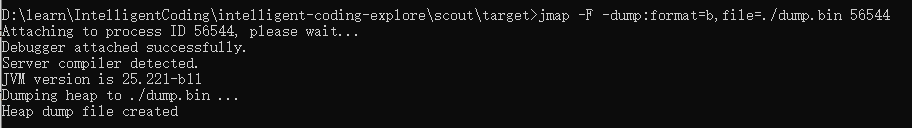

# 强化JVM技术

我们都知道JVM得作用和地位，以及简单得了解JVM是如何进行运行的，但在JVM的执行过程中，我们能够做什么，有那些特定的API是为我们开发者所提供的。以上提到的这些都是很重要的，对于一个不甘做CRUD开发的我们来说，这些都是需要我们自己去探知和学习的，有了这些法宝，我们就有办法来让JVM为我们进行定制的功能提供服务，不在在就是当作一个Java语言的容器，它的功能就会变得更加强大！在日常开发中，我们都会遇见类加载器、反射、注解处理器、编译器、agent探针技术等等与JVM息息相关得技术点，为了武装自己，让自己变得更加强大，我们开始JVM之旅吧！

## JVM问题排查指令

在日常工作开发中，我们或多或少都会遇见一些很难定位的JVM问题，比如内存泄漏，服务GC次数过多，程序运行过程中的堆栈内存情况，运行时的服务服务堆栈问题等等。想要定位、排查、分析、解决这些问题，我们通过一些特有的JVM指令便可以观察到，下面我们通过小demo使用下这些指令。

### jps指令：显示指定系统内所有的HotSpot虚拟机进程

示例命令行如下：

```cmd
> jps
```


**参考文档：[jinfo官方介绍](https://docs.oracle.com/javase/8/docs/technotes/tools/unix/jps.html)**
>__-q__：抑制类名、JAR 文件名和传递给 main 方法的参数的输出，仅生成本地 VM 标识符列表。
>__-m__：输出传递给 main 方法的参数。 对于嵌入式 JVM，输出可能为空。
>__-l__：输出应用程序主类的完整包名或应用程序 JAR 文件的完整路径名。
>__-v__：输出传递给 JVM 的参数。
>__-V__：通过标志文件（.hotspotrc 文件或 -XX:Flags=\<filename> 参数指定的文件）输出传递给 JVM 的参数。

### jinfo指令：显示虚拟机配置信息

一个简单的使用命令如下：

```cmd
> jinfo -flags 56544
```


这个命令的含义是，输出vimid=56544默认使用的flag信息（flag就是通过-XX参数指定的标志）
**参考文档：[jinfo官方介绍](https://docs.oracle.com/javase/8/docs/technotes/tools/unix/jinfo.html)**
>不携带任何options参数时，默认打印命令行标志以及系统属性名称、值对信息。
>__-flag name__：打印给定命令行标志的名称和值。
>__-flag [+|-]name__：启用或禁用给定的布尔命令行标志。
>__-flag name=value__：将给定的命令行标志设置为指定值。
>__-flags__：打印传递给JVM的命令行标值，该选项可以看到默认的flag数据。
>__-sysprops__：将Java系统属性打印为名称, 键值对形式输出。
>__-h__：输出命令的帮助信息。
>__-h或-help__：输出命令的帮助信息。

### jstat指令：用于收集HotSpot虚拟机各方面的运行数据

这个命令在我们进行JVM问题排查和性能优化的过程中会经常使用到，它可以告诉我们虚拟机的gc情况，堆内存的使用率等情况，可谓利器，经常会使用到一个命令如下：

```cmd
> jstat -gcutil 56544 3s 7
```


这个命令表示每隔3s输出一次vimid=56544的gc情况以及当前堆内存控间的使用率，总共输出7次后停止！
**参考文档：[jstat官方介绍](https://docs.oracle.com/javase/8/docs/technotes/tools/unix/jstat.html)**
>__-class__：显示有关类加载器行为的统计信息。
>__-compiler__：显示有关 Java HotSpot VM 即时编译器行为的统计信息。
>__-gc__：显示有关垃圾收集堆行为的统计信息。
>__-gccapacity__：显示有关各代容量及其相应空间的统计信息。
>__-gccause__：显示有关垃圾收集统计信息的摘要（与 -gcutil 相同），以及上次和当前（适用时）垃圾收集事件的原因。
>__-gcnew__：显示新生代行为的统计信息。
>__-gcnewcapacity__：显示有关新生代大小及其相应空间的统计信息。
>__-gcold__：显示有关老年代和元空间统计信息的行为的统计信息。
>__-gcoldcapacity__：显示有关老年代大小的统计信息。
>__-gcmetacapacity__：显示有关元空间大小的统计信息。
>__-gcutil__：显示有关垃圾收集统计信息的摘要。
>__-printcompilation__：显示 Java HotSpot VM 编译方法统计信息。
>__-h n__：n 个样本（输出行）显示一个列标题，其中 n 是正整数。 默认值为 0，即显示列标题第一行的数据。
>__-t__：将时间戳列显示为输出的第一列。 时间戳是自目标 JVM 启动时间以来的时间。

### jmap指令：生成虚拟机的内存转储快照（heapdump文件）

jmap命令是一个很核心的jvm调优和问题排查命令，当我们的系统出现OOM或load飙升时，通过当前命令可获取java进程的内存快照在结合jhat、jvisualvm、MAT等工具来分析，结合代码即可找到问题点！一个关于当前命令的高频用法如下：

```cmd
> jmap -dump:format=b,file=./dump.bin 56544
```


命令执行完成后，当前目录下生成了一个一个名为dump.bin的堆栈快照文件！
**参考文档：[jmap官方介绍](https://docs.oracle.com/javase/8/docs/technotes/tools/unix/jmap.html)**
>当没有使用任何选项时，jmap 命令打印共享对象映射。 对于加载到目标 JVM 中的每个共享对象，打印起始地址、映射大小和共享对象文件的完整路径。 此行为类似于 Oracle Solaris pmap 实用程序。
>__--dump:[live,] format=b, file=filename__：将hprof二进制格式的Java堆转储到指定的文件中。live子选项是可选的，但指定时，只会转储堆中的活动对象。要浏览堆转储，您可以使用jhat命令读取生成的文件。
>__-finalizerinfo__：打印有关等待完成的对象的信息。
>__-heap__：打印所用垃圾收集的堆摘要、头部配置和分代堆使用情况。此外，还打印了驻留字符串的数量和大小。
>__-histo[:live]__：打印堆的直方图。对于每个Java类，打印对象数、内存大小（以字节为单位）和完全限定的类名。JVM内部类名称带有星号(*)前缀。 如果指定了live子选项，则只计算活动对象。
>__-clstats__：打印Java堆的类加载器合理的统计信息。对于每个类加载器，它的名称、它的活跃程度、地址、父类加载器以及它加载的类的数量和大小都会被打印出来。
>__-F__：强制执行命令。 当pid不响应时，将此选项与 jmap -dump 或 jmap -histo 选项一起使用。 此模式不支持live子选项。
>__-h或-help__：输出当前命令的帮助信息。同样也可以使用 -?

### jhat指令：用于分析heapdump文件，它会建立一个HTTP/HTML服务器，让用户在浏览器上看到分析结果

jhat可以分析jmap -dump所产生的文件，并通过web页面为我们进行展示！

```cmd
> jhat -port 9999 dump
```


执行命令后，我们看到控制台已经提示我们在本地开启了一个9999的web服务端口，通过地址:`http://127.0.0.1:9999`进行访问，就可以看到内存分析数据！这个分析的数据识别度和可读性还是不友好，可以采用MAT这个专业的分析工具来查看，数据图表会更加直观!
**参考文档：[jhat官方介绍](https://docs.oracle.com/javase/8/docs/technotes/tools/unix/jhat.html)**
>__-stack false|true__：关闭跟踪对象分配调用堆栈。 如果分配站点信息在堆转储中不可用，则必须将此标志设置为 false。 默认为真。
>__-refs false|true__：关闭对对象引用的跟踪。 默认为真。 默认情况下，为堆中的所有对象计算后向指针，即指向指定对象（例如引用者或传入引用）的对象。
>__-port port-number__：设置 jhat HTTP 服务器的端口。 默认值为 7000。
>__-exclude exclude-file__：指定一个文件，该文件列出应从可达对象查询中排除的数据成员。 例如，如果文件列出了 java.lang.String.value，那么无论何时计算从特定对象 o 可达的对象列表，都不会考虑涉及 java.lang.String.value 字段的引用路径。
>__-baseline exclude-file__：指定基线堆转储。 两个堆转储中具有相同对象 ID 的对象被标记为不是新的。 其他对象被标记为新的。 这对于比较两个不同的堆转储很有用。
>__-debug int__：设置此工具的调试级别。 级别 0 表示没有调试输出。 为更详细的模式设置更高的值。
>__-version__：报告版本号并退出
>__-h或-help__：输出当前命令的帮助信息。同样也可以使用

### jstack指令：显示虚拟机的线程快照

在开发过程中，偶尔会遇见服务起load飙升，线程死锁，线程耗尽等问题，如果我们可以捕获到当前服务运行时线程堆栈信息，并找到阻塞的线程即可定位异常代码所处的位置！jstack的作用就是获取这些数据，便于我们分析！

```cmd
> jstack -F -l 56544
```


通过截图，可以看到命令执行完成后，为我们展示了当前java进程的线程堆栈快照信息，线程处于什么状态，当前执行到的代码段等等信息，信息的开头提示了我们当前存不存在线程死锁的情况！
**参考文档：[jstack官方介绍](https://docs.oracle.com/javase/8/docs/technotes/tools/unix/jstack.html)**
>__-F__：当 jstack [-l] pid 没有响应时强制进行堆栈转储。
>__-l__：长监听。 打印有关锁的附加信息，例如拥有的 java.util.concurrent 可拥有同步器的列表。
>__-m__：打印具有 Java 和本机 C/C++ 帧的混合模式堆栈跟踪。
>__-h或-help__：输出当前命令的帮助信息。

## Agent探针技术

在JDK的标准文档中，有对agent探针的介绍资料了，如果不是很了解， 可以去google看看！在我们的开发中，我们或多或少的都有使用到过agent技术，只是我们并没有进行相应的功能开发，只是采用了第三方通过agent所开发和支持的功能，例如：SkyWalking，SandBox，Arthas等等优秀的开源项目都有运用到agent技术。官方文档介绍或说明：[instrument技术](https://docs.oracle.com/en/java/javase/11/docs/api/java.instrument/java/lang/instrument/package-summary.html)

### 如何实现一个自己的Agent

其实这个实现起来，也是很简单的，只需要定义一个类，提供两个agent会调用的并完成自己的功能逻辑即可，开起来就像下面这样子：

- 第一步：定义一个agent类

```java
    public class MyAgent {

        /**
        *  当执行main方法是，该方法会被执行
        */
        public static void premain(String agentArgs, Instrumentation inst) {
            System.out.println("MyAgent premain invoked!");
        }

        /**
        *  通过JVM执行参数来执行，或者通过另一个main方法来将当前的agent attach到一个正在执行的java进程
        */
        public static void agentmain(String agentArgs, instrumentation inst) {
            System.out.println("MyAgent agentmain invoked!");
        }
    }
```

- 第二步：添加一个Manifest文件，来描述我们的agent
  这个文件的内容很简单，描述了那个类作为一个agent类被调用，以及是否使用缓存项等信息即可，配置项如下图所示：
  
  在当前的这个例子中，对应的文件内容为：

  ```txt
    Manifest-Version: 1.0
    Agent-Class: cn.h2uwei.agent.MyAgent
    Can-Redefine-Classes: true
    Can-Retransform-Classes: true
    Premain-Class: cn.h2uwei.agent.MyAgent
  ```

- 第三步：对agent进行打包：
  - 通过命令行的方式：
  
    ```cmd
    jar -cmf META-INF/MANIFEST.MF myagent.jar cn/h2uwei/agent/
    MyAgent.class
    ```

  - 通过maven构建:
    对应模块的pom.xml文件中，加入插件maven-jar-plugin

    ```xml
        <build>
            <plugins>
                <plugin>
                    <groupId>org.apache.maven.plugins</groupId>
                    <artifactId>maven-jar-plugin</artifactId>
                    <version>3.3.0</version>
                    <configuration>
                        <archive>
                            <manifestFile>src/main/resources/META-INF/MANIFEST.MF</manifestFile>
                        </archive>
                    </configuration>
                </plugin>
            </plugins>
        </build>
    ````

- 第四步：执行agent
  
  - 静态加载，通过命令行的方式：
  
    ```cmd
        java -javaagent:myagent.jar -jar application.jar
    ```

  - 动态加载，将agent载入一个正在执行的java进程中:
  
    ```java
        public class DynamicLoadAgent {
            public static void main(String[] args) {
                try {
                    String agentPath = "D:\\learn\\IntelligentCoding\\intelligent-coding-explore\\agent\\target\\agent-1.0.jar";
                    VirtualMachine vm = VirtualMachine.attach("20568");
                    vm.loadAgent(agentPath);
                    vm.detach();
                } catch (Exception e) {
                    System.out.println("出现异常了...");
                    e.printStackTrace();
                }
            }
        }
    ```

通过以上四步我们就完成并实现了一个简单的agent，对于任何一个agent来讲，重点都在于如何实现自己的核心功能，被赋能的agent才具有实际价值和含义。

### Instrumentation接口

这个API的作用非常强大，我们可以通过它获取已经加载的类信息、重新定义类、转化类信息等高级操作。这也就意味着我们可以通过在agent来修改JVM已加载的类数据信息，从而达到想要的目的！接口官方API文档信息：[Instrumentation](https://docs.oracle.com/en/java/javase/11/docs/api/java.instrument/java/lang/instrument/Instrumentation.html)
