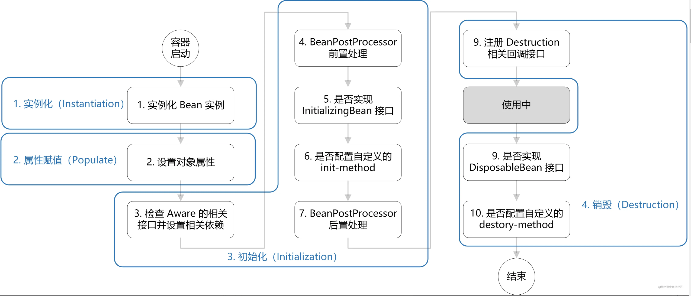

### spring bean的生命周期

+ 1）实例化： 通过反射创建一个class的实例
+ 2）属性赋值：设置实例化出来的对象属性
+ 3）绑定Aware接口：检查当前bean是否实现了Aware相关接口，并设置相关依赖
+ 4）BeanPostProcessor前置处理：调用BeanPostProcessor接口实现类的前置处理方法
+ 5）是否实现InitializingBean接口
+ 6）init-method：调用配置的init-method方法
+ 7）BeanPostProcessor后置处理：调用BeanPostProcessor接口实现类的后置处理方法
+ 8）使用中
+ 9）注册Destruction相关回调接口
+ 10）是否实现了DisposableBean接口
+ 11）是否配置自定义的Destroy-method

> [1]-实例化阶段（Instantiation）；[2]-属性赋值阶段（Populate）；[3-7]-初始化阶段（Initialization）；[8]-存活阶段（Alive）；[9-11]
> -销毁（Destruction）

### Spring容器的启动步骤

