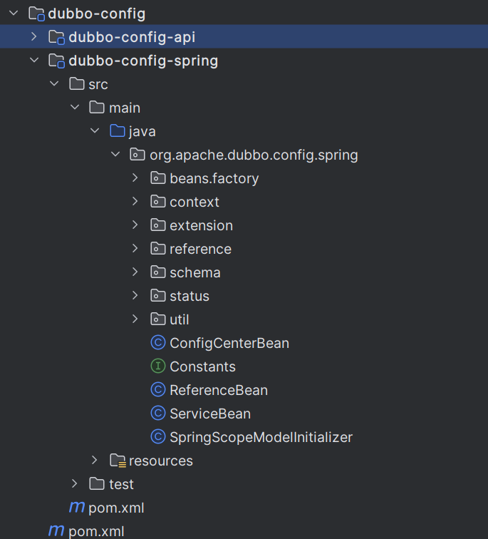
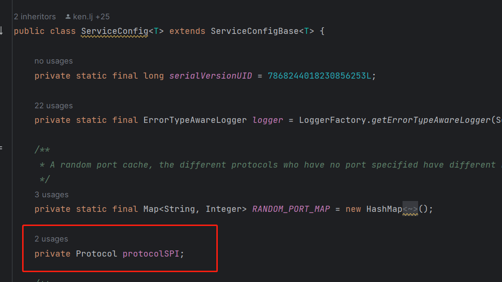
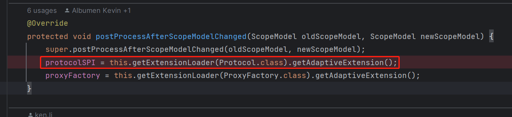

#### 一、netty中的ChannelOption<?>模型

第一眼看到这个模型有点很蒙，一个Bootstrap或者ServerBootstrap实例的`option方法`居然可以写入不同的value（可能我比较傻，见到的写法太少了！）。
感觉很牛逼很有意思，就在想这个是怎么做到的呢？在进行了代码调用和查看后大概理解了一点，所以就简单的记录了一下。
> 这里面对常量类进行了接口抽象，不同维度的抽象类都会存在自己的常量池。每个常量类都存在一个唯一的名称和一个唯一的ID（这个ID属于当前这个维度下）
> 而这个option方法采用了泛型化描述，所以可以一个方法搞定option属性的设置！这个常量池化的抽象思想真的很牛逼。当需要获取option所绑定的值时，
> 通过判断实例是否相同即可，在进行数据的获取操作

#### 二、dubbo相关

阅读的dubbo源码的过程中，探究了spi、dubbo协议、client、server、export等组件及特性的加载、实例化、绑定、初始化源码。在阅读的过程中，各个组件源码
之间跳来跳去，似乎有点晕了！我一直在想一个问题：那么dubbo如何进行rpc-provider服务配置、实例化以及暴露呢？对于spring的启动，阅读过源码的话都知道它核心代码就在
`AbstractApplicationContext`对象的`refresh`方法里（这里面有13个方法，具体多少个我也没仔细数，网上都这么说！版本的不同可能方法也会有变化）。

##### 1） dubbo服务配置（与spring进行结合）

+ SpringBootStarter机制
+ spring注解驱动
+ spring配置文件

##### 2） spring识别dubbo维度的bean并完成实例化及注入

要想让spring识别一个dubbo-bean还真是一个简单的事，当时也并非难事！阅读过spring源码的话，应该很清楚spring给我们提供了很多扩展机制来让我们对bean进行
增强处理，常见的手段有：实现Aware相关接口、自定义BeanFactoryPostProcessor、BeanPostProcessor等方式。当然dubbo框架也不列外，也是采用了这种手段
来对dubbo服务相关的bean进行识别后暴露的！
这里尤其需要关注两个类模型：`ServiceConfig`、`ReferenceConfig`，他们位于dubbo-config-api模块中！
这两个类模型至关重要，它是dubbo为了与其他框架进行适配而抽线出来的模型，对应了服务提供者和消费者配置模型！

这部分模块的代码帮我们详细的描述了如何扫描一个dubbo配置文件（xml），如何进行bean增强处理等与spring进行适配融合相关的代码，很值得去深究和理解！

##### 3） 暴露服务并启动server服务

在dubbo服务在进行暴露时都会对应一个具体的invoker模型，dubbo将每一个可以被调用的rpc服务节点都伪装成了一个具体的invoker实例。
在一个dubbo服务进行远程注册和暴露的过程中，会进行两次`export`操作：

+ 1）根据应用配置找到对应的Registry协议进行远成服务地址注册
+ 2）选择指定的rpc协议完成本地服务提供者暴露（本次暴露会提供一个网路服务，例如http、netty服务等）

没有一个dubbo服务类都会被包装成一个`ServiceConfig实例`，并通过它的`export方法`进行服务实现dubbo服务的暴露，
通过`服务URL结合SPI机制`来选择合适的 协议实现类完成服务的暴露工作。
对于ServiceConfig实例所持有的`protocolSPI属性`很关键，对该属性值进行赋值的时候采用的是SPI机制，具体代码片段如下：


以上代码端获取到的Protocol适配类，本质上是通过SPI机制通过JDK，Javasist动态生成的Protocol适配类，

```java
package org.apache.dubbo.rpc;

import org.apache.dubbo.rpc.model.ScopeModel;
import org.apache.dubbo.rpc.model.ScopeModelUtil;

public class Protocol$Adaptive implements org.apache.dubbo.rpc.Protocol {
    public void destroy() {
        throw new UnsupportedOperationException("The method public abstract void org.apache.dubbo.rpc.Protocol.destroy() of interface org.apache.dubbo.rpc.Protocol is not adaptive method!");
    }

    public int getDefaultPort() {
        throw new UnsupportedOperationException("The method public abstract int org.apache.dubbo.rpc.Protocol.getDefaultPort() of interface org.apache.dubbo.rpc.Protocol is not adaptive method!");
    }

    public java.util.List getServers() {
        throw new UnsupportedOperationException("The method public default java.util.List org.apache.dubbo.rpc.Protocol.getServers() of interface org.apache.dubbo.rpc.Protocol is not adaptive method!");
    }

    public org.apache.dubbo.rpc.Exporter export(org.apache.dubbo.rpc.Invoker arg0) throws org.apache.dubbo.rpc.RpcException {
        if (arg0 == null) throw new IllegalArgumentException("org.apache.dubbo.rpc.Invoker argument == null");
        if (arg0.getUrl() == null)
            throw new IllegalArgumentException("org.apache.dubbo.rpc.Invoker argument getUrl() == null");
        org.apache.dubbo.common.URL url = arg0.getUrl();
        String extName = (url.getProtocol() == null ? "dubbo" : url.getProtocol());
        if (extName == null)
            throw new IllegalStateException("Failed to get extension (org.apache.dubbo.rpc.Protocol) name from url (" + url.toString() + ") use keys([protocol])");
        ScopeModel scopeModel = ScopeModelUtil.getOrDefault(url.getScopeModel(), org.apache.dubbo.rpc.Protocol.class);
        org.apache.dubbo.rpc.Protocol extension = (org.apache.dubbo.rpc.Protocol) scopeModel.getExtensionLoader(org.apache.dubbo.rpc.Protocol.class).getExtension(extName);
        return extension.export(arg0);
    }

    public org.apache.dubbo.rpc.Invoker refer(java.lang.Class arg0, org.apache.dubbo.common.URL arg1) throws org.apache.dubbo.rpc.RpcException {
        if (arg1 == null) throw new IllegalArgumentException("url == null");
        org.apache.dubbo.common.URL url = arg1;
        String extName = (url.getProtocol() == null ? "dubbo" : url.getProtocol());
        if (extName == null)
            throw new IllegalStateException("Failed to get extension (org.apache.dubbo.rpc.Protocol) name from url (" + url.toString() + ") use keys([protocol])");
        ScopeModel scopeModel = ScopeModelUtil.getOrDefault(url.getScopeModel(), org.apache.dubbo.rpc.Protocol.class);
        org.apache.dubbo.rpc.Protocol extension = (org.apache.dubbo.rpc.Protocol) scopeModel.getExtensionLoader(org.apache.dubbo.rpc.Protocol.class).getExtension(extName);
        return extension.refer(arg0, arg1);
    }
}

```

> 选择协议protocol->启动server->Exchangers.bind(返回ExchangeServer)->HeaderExchangeServer(
> PortUnificationExchanger.bind/Transporters.bind)

##### 4） dubbo中的DubboBootstrap

这个类很关键，是来启动dubbo相关服务的，类似spring中的各种Context类。

#### 三、ThreadExecutorPool与ForkJoinPool的关系