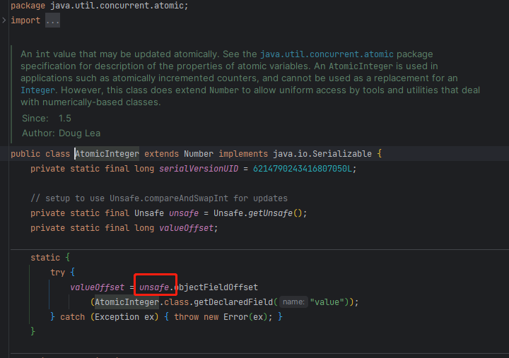

#### 一、netty中的ChannelOption<?>模型

第一眼看到这个模型有点很蒙，一个Bootstrap或者ServerBootstrap实例的`option方法`居然可以写入不同的value（可能我比较傻，见到的写法太少了！）。
感觉很牛逼很有意思，就在想这个是怎么做到的呢？在进行了代码调用和查看后大概理解了一点，所以就简单的记录了一下。
> 这里面对常量类进行了接口抽象，不同维度的抽象类都会存在自己的常量池。每个常量类都存在一个唯一的名称和一个唯一的ID（这个ID属于当前这个维度下）
> 而这个option方法采用了泛型化描述，所以可以一个方法搞定option属性的设置！这个常量池化的抽象思想真的很牛逼。当需要获取option所绑定的值时，
> 通过判断实例是否相同即可，在进行数据的获取操作

#### 二、dubbo相关

阅读的dubbo源码的过程中，探究了spi、dubbo协议、client、server、export等组件及特性的加载、实例化、绑定、初始化源码。在阅读的过程中，各个组件源码
之间跳来跳去，似乎有点晕了！我一直在想一个问题：那么dubbo如何进行rpc-provider服务配置、实例化以及暴露呢？对于spring的启动，阅读过源码的话都知道它核心代码就在
`AbstractApplicationContext`对象的`refresh`方法里（这里面有13个方法，具体多少个我也没仔细数，网上都这么说！版本的不同可能方法也会有变化）。

##### 1） dubbo服务配置（与spring进行结合）

+ SpringBootStarter机制
+ spring注解驱动
+ spring配置文件

##### 2） spring识别dubbo维度的bean并完成实例化及注入

要想让spring识别一个dubbo-bean还真是一个简单的事，当时也并非难事！阅读过spring源码的话，应该很清楚spring给我们提供了很多扩展机制来让我们对bean进行
增强处理，常见的手段有：实现Aware相关接口、自定义BeanFactoryPostProcessor、BeanPostProcessor等方式。当然dubbo框架也不列外，也是采用了这种手段
来对dubbo服务相关的bean进行识别后暴露的！
这里尤其需要关注两个类模型：`ServiceConfig`、`ReferenceConfig`，他们位于dubbo-config-api模块中！
这两个类模型至关重要，它是dubbo为了与其他框架进行适配而抽线出来的模型，对应了服务提供者和消费者配置模型！

这部分模块的代码帮我们详细的描述了如何扫描一个dubbo配置文件（xml），如何进行bean增强处理等与spring进行适配融合相关的代码，很值得去深究和理解！

##### 3） 暴露服务并启动server服务

在dubbo服务在进行暴露时都会对应一个具体的invoker模型，dubbo将每一个可以被调用的rpc服务节点都伪装成了一个具体的invoker实例。
在一个dubbo服务进行远程注册和暴露的过程中，会进行两次`export`操作：

+ 1）根据应用配置找到对应的Registry协议进行远成服务地址注册
+ 2）选择指定的rpc协议完成本地服务提供者暴露（本次暴露会提供一个网路服务，例如http、netty服务等）

没有一个dubbo服务类都会被包装成一个`ServiceConfig实例`，并通过它的`export方法`进行服务实现dubbo服务的暴露，
通过`服务URL结合SPI机制`来选择合适的 协议实现类完成服务的暴露工作。
对于ServiceConfig实例所持有的`protocolSPI属性`很关键，对该属性值进行赋值的时候采用的是SPI机制，具体代码片段如下：


以上代码端获取到的Protocol适配类，本质上是通过SPI机制通过Jdk，Javassist动态生成的Protocol适配类，生成Adaptive类的生成器类为`AdaptiveClassCodeGenerator`

```java

package org.apache.dubbo.rpc;

import org.apache.dubbo.rpc.model.ScopeModel;
import org.apache.dubbo.rpc.model.ScopeModelUtil;

public class Protocol$Adaptive implements org.apache.dubbo.rpc.Protocol {
    public void destroy() {
        throw new UnsupportedOperationException("The method public abstract void org.apache.dubbo.rpc.Protocol.destroy() of interface org.apache.dubbo.rpc.Protocol is not adaptive method!");
    }

    public int getDefaultPort() {
        throw new UnsupportedOperationException("The method public abstract int org.apache.dubbo.rpc.Protocol.getDefaultPort() of interface org.apache.dubbo.rpc.Protocol is not adaptive method!");
    }

    public java.util.List getServers() {
        throw new UnsupportedOperationException("The method public default java.util.List org.apache.dubbo.rpc.Protocol.getServers() of interface org.apache.dubbo.rpc.Protocol is not adaptive method!");
    }

    public org.apache.dubbo.rpc.Exporter export(org.apache.dubbo.rpc.Invoker arg0) throws org.apache.dubbo.rpc.RpcException {
        if (arg0 == null) throw new IllegalArgumentException("org.apache.dubbo.rpc.Invoker argument == null");
        if (arg0.getUrl() == null)
            throw new IllegalArgumentException("org.apache.dubbo.rpc.Invoker argument getUrl() == null");
        org.apache.dubbo.common.URL url = arg0.getUrl();
        String extName = (url.getProtocol() == null ? "dubbo" : url.getProtocol());
        if (extName == null)
            throw new IllegalStateException("Failed to get extension (org.apache.dubbo.rpc.Protocol) name from url (" + url.toString() + ") use keys([protocol])");
        ScopeModel scopeModel = ScopeModelUtil.getOrDefault(url.getScopeModel(), org.apache.dubbo.rpc.Protocol.class);
        org.apache.dubbo.rpc.Protocol extension = (org.apache.dubbo.rpc.Protocol) scopeModel.getExtensionLoader(org.apache.dubbo.rpc.Protocol.class).getExtension(extName);
        return extension.export(arg0);
    }

    public org.apache.dubbo.rpc.Invoker refer(java.lang.Class arg0, org.apache.dubbo.common.URL arg1) throws org.apache.dubbo.rpc.RpcException {
        if (arg1 == null) throw new IllegalArgumentException("url == null");
        org.apache.dubbo.common.URL url = arg1;
        String extName = (url.getProtocol() == null ? "dubbo" : url.getProtocol());
        if (extName == null)
            throw new IllegalStateException("Failed to get extension (org.apache.dubbo.rpc.Protocol) name from url (" + url.toString() + ") use keys([protocol])");
        ScopeModel scopeModel = ScopeModelUtil.getOrDefault(url.getScopeModel(), org.apache.dubbo.rpc.Protocol.class);
        org.apache.dubbo.rpc.Protocol extension = (org.apache.dubbo.rpc.Protocol) scopeModel.getExtensionLoader(org.apache.dubbo.rpc.Protocol.class).getExtension(extName);
        return extension.refer(arg0, arg1);
    }
}

```

> 选择协议protocol->启动server->Exchangers.bind(返回ExchangeServer)->HeaderExchangeServer(
> PortUnificationExchanger.bind/Transporters.bind)

##### 4） dubbo中的DubboBootstrap

这个类很关键是来启动dubbo服务类似spring中的各种Context类，会完成dubbo启动的一些列前置工作，确定采用的框架模型时哪一种，进行服务模块的部署，建立注册中心长连接

#### 三、关于ThreadPoolExecutor与ForkJoinPool

它们内部维护了一组线程主要职责是进行异步任务逻辑处理，执行线程如果需要开始子流程的异步执行就会将对应子流程包装成一个任务实例并提交给它们来完成异步操作！是提高吞吐和效率的利剑，其实用到他们的地方很多，
诸如：tomcat的内部线程池，dubbo的线程池，httpclient线程池等等，它们的身影一直都在！

##### 1）线程池（ThreadPoolExecutor）

其内部通过一个通过阻塞队列来存储执行线程提交的任务，并在其实例内部维护了一组worker用来完成对任务异步处理，可以类比工厂的工作模式来进行理解。
> 例如：现在存在一个加工厂，工厂招收了N名工人为其工作，每一个工人能够完整的完成工厂分配给他们的任务。而工厂的工人都存在一个体质，
> 拥有了超出常人“负责人“和”自我压榨“的敬业精神，他们在完成自己手上的工作后，会去查看是否还有工作需要被完成，如果存在就获取任务并执行。
> 工作的过程中，他们都不会互选内耗，很积极，很主动的去完成工作，以工厂的利益最大化，没日没夜地干者工作，丝毫不敢停息。没有工作的时候他们会稍微休息一下下！

##### 2）ForkJoinPool

这个异步执行框架对比线程池还是有很大的不同的，它的特点是，所有的Worker都拥有自己的队列并且这个队列是双端的，
任务从头部进行添加，而Worker处理自身任务时取决于指定的模式（FIFO或LIFO），窃取任务则采用FIFO！
它还会有一个非常与众不同的特点就是”任务窃取“机制。JDK9中的协程机制就是采用它实现的！
> 这个理解起来就是按照工作量进行薪资计算一样，你拥有很多任务可以做当你在窃喜的时候， 由于你的任务执行起来并不简单很耗时，
> 这时候另外一个同事的工作干完了，他便以帮助高效工作的理由”掠夺“你的任务，最终自我利益最大化！

##### 3）差异点

他们两个虽然都是为了异步任务执行，但是在实现原理和任务执行机制上还是不太一样，所适应的场景也存在细微差别！

+ ThreadPoolExecutor不能对任务进行拆分，ForkJoinPool可以将一个大任务拆成几个小任务进行执行（典型案例：斐波那契数列计算）
+ ThreadPoolExecutor仅存在任务队列，ForkJoinPool中存在两种队列，一种基本任务队列，一个与线程绑定的队列（当执行任务时，线程会从基本队列中获取任务并加入自己所绑定的任务队列中）
+ ForkJoinPool更加偏向于对任务的拆分，采用了“分而治之”的思想，更适合计算密集型的任务处理

#### 四、spring

##### 1） 如何结合Spring开发

通过对源码的阅读，深刻的认识了Spring提供的SPI扩展机制很强大。可以将我们自定义框架与Spring适配整合始终离不开BeanFactoryPostProcessor、BeanPostProcessor等相关的接口，来扫描我们自定义的bean定义路径加载我们的bean等等!
在对dubbo源码进行阅读的过程中,就在想一个问题dubbo如何解析dubbo的xml配置文件并加载bean的过程，看到了几个很关键的类`org.apache.dubbo.config.spring.schema.AnnotationBeanDefinitionParser`、
`org.apache.dubbo.config.spring.beans.factory.annotation.ServiceAnnotationPostProcessor`
等多个后置处理器，`org.apache.dubbo.config.spring.context.DubboSpringInitializer`是dubbo整合Spring的初始化器！
之前在阅读mybatis源码的时候也看到了Spring相关后置处理器的代码，那个时候并没有感觉到它的魅力，通过xxl-job，dubbo的源码的阅读让我开始觉得Spring源码中的后置处理器并不简单，很有魔力！

#### 五、关于Java中的Unsafe类

在对源码阅读的过程中，无论是JDK还是还是各大主流的框架源码都存在直接操作Unsafe这个类的场景，即使JDK并不提倡这么操作，仍然存在很多使用者通过它来完成自己的目的！
在JDK的AtomicXXX的相关的类中，总是能看见它的身影！如下展示了AtomicInteger中对Unsafe实例的引用：

众所周知，原子类采用的都是CAS机制实现，同时他们也是线程安全的类型！实现这个能力的核心就是Unsafe的原因，
通过操作`unsafe.compareAndSwapXXXX`方法， 之所以不建议直接操作是因为它会直接从操作引用类型的指针完成数据修改，稍有不慎就可能出现内存泄露的危险！
[baeldung Unsafe使用](https://www.baeldung.com/java-unsafe)讲述了这个类的使用方式，并对比了它和采用JDK关键字new进行实例化的区别。
使用`unsafe#allocateInstance(Class<T> cls)`进行类对象实例化时，仅仅只是为对象分配了内存空间以及属性的默认值处理，并不会执行构造方法中的代码块！
Unsafe主要的功能点如下：

+ 实例化Class获得类对象（实例）
+ 修改私有属性值
+ 抛出异常，但不限制调用者处理该异常，即使是一个受检异常
+ 使用非堆内存，不在受限于JVM内存，GC回收机制，手动释放不可忘！！！
+ 通过`CompareAndSwap`实现CAS无锁操作
+ 利用`Park/Unpark`接口实现线程的切换


