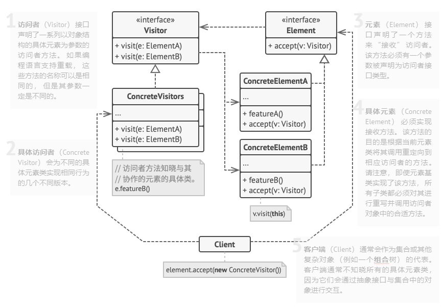

## 设计模式

程序的设计与实现或多或少的都会运用到设计模式来进行处理，因为它能使我们的程序或者框架结构清晰、代码复用率高、已于扩展、稳定性得到保证等特点。
这里有一个关于设计模式讲解的网站，非常不错！毫不吝啬的把链接扔出来：https://refactoringguru.cn/design-patterns

### 访问者模式

当我们需要对一个模型的属性进行逐一深度访问，并且这些不同属性的访问行为会变化时，那么我们的访问者设计模式就排上用场了。
我们的模型仅需要实现访问者接口， 具体的访问行为由外部使用者决定。当我们需要对某个属性的访问行为进行变化时，
只需要修改或者替换具体的访问者就可以，模型的封闭性得到了保证。类图模型如下所示：

